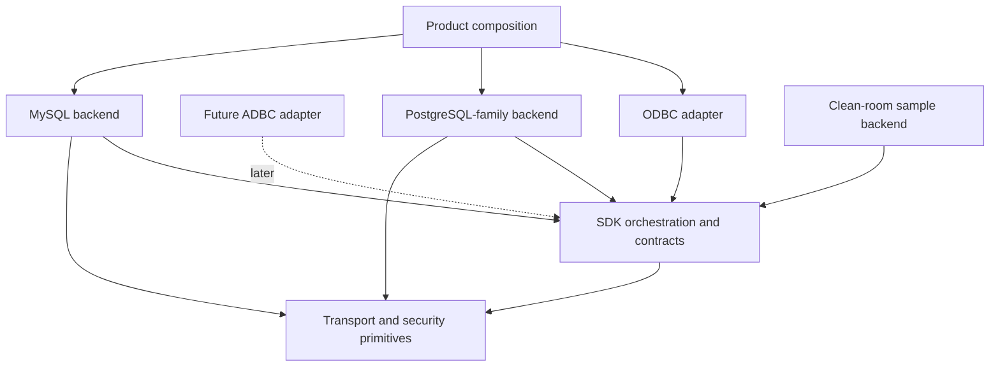

# Connectivity SDK architecture contract

Decision date: 2026-09-30.
Audit baseline: `089e085` on `codex/transport-foundation`.
Status: S1 architecture baseline accepted for S2 implementation. Internal names
may change during migration; responsibilities and dependency rules are frozen.

This document defines the engineering boundary required by G12. It was derived
from four independent read-only reviews: dependency/leakage, pooling/cache,
MySQL/external-author usability, and code/architecture security. It describes
the intended architecture, not the current implementation state. Existing
PostgreSQL behavior remains protected by its complete regression gates.

## Decisions

| ID | Accepted decision | Consequence |
|---|---|---|
| A1 | PostgreSQL and MySQL are sibling backends behind SDK contracts | Neither backend wraps or depends on the other |
| A2 | `GenericDatabaseConnection` and `IProtocolParser` are PostgreSQL-family session machinery | Reclassify them during S2; do not add MySQL conditionals or make the parser a public SDK interface |
| A3 | Backend sessions own framing, handshake, authentication, protocol state, execution and recovery | Share transport/security/deadline primitives only where semantics agree |
| A4 | A static backend provider is separate from a live session | Product identity/defaults/options/static capabilities do not require constructing a fake disconnected session |
| A5 | Results and errors cross the SDK boundary in normalized, owning forms | PostgreSQL OIDs/tags/format codes and MySQL type/flag/packet fields remain private |
| A6 | Product composition owns compile-time backend registration | G12 requires one documented registration point, not runtime plugins or a stable ABI |
| A7 | The current `ConnectionPool` is prototype code and will not define the SDK pool contract | Replace its shared-pointer/manual-release model before any reuse claim; keep it internal and unadvertised meanwhile |
| A8 | ODBC is the first client adapter; ADBC attaches later through a batch-result seam | No Arrow or ADBC dependency enters G12 |
| A9 | Secure transport/authentication, resource budgets and extension trust are architecture concerns | The mandatory rules are in [SECURITY_MODEL.md](SECURITY_MODEL.md) |

## Dependency model

The apparent arrows from concrete backends to SDK mean that they implement SDK
contracts. SDK orchestration never includes or links concrete backend code.
Product composition selects one provider and injects it into the adapter.

Required build-layer direction:

1. `transport` depends only on utility/security primitives.
2. `sdk_contracts` depends on utility types and may refer to transport factories,
   never concrete transports or backends.
3. Concrete backends depend on `sdk_contracts` and `transport`.
4. SDK orchestration depends only on `sdk_contracts`.
5. ODBC depends on SDK orchestration and ODBC headers, never concrete backend or
   protocol headers.
6. Product composition depends on the selected adapter and concrete backend.

CI will reject backend-to-ODBC includes, transport-to-database includes, sibling
backend includes, protocol/native identifiers in shared ODBC workflows, backend
selection macros outside composition/family code, and layer cycles.

## Extension-facing contracts

Names below are conceptual internal names. S2 may adjust spelling without
changing their responsibilities.

### `BackendProvider`

One immutable provider exists per backend product. It owns:

- stable backend identifier and display/driver/setup identity;
- default port, optional database/catalog default and secure TLS policy;
- common and backend-specific connection-property schema and validation;
- static capability and normalized type profiles available before connection;
- pure SQL dialect and marker-processing service;
- creation of one live `BackendSession` from validated owning settings, an
  injected transport factory/security context and resource limits;
- optional facet declarations.

The provider does not hold credentials or mutable server state. Explicit product
selection is authoritative. Unknown URL schemes or ports must return an error,
not silently select PostgreSQL.

### `BackendSession`

A live session owns protocol and server state. It provides:

- open/close and explicit passive state;
- direct and parameterized execution;
- statement description when advertised;
- absolute deadlines for every blocking operation;
- owning normalized results or a structured `BackendError`;
- transaction control through an optional declared facet;
- catalog metadata through an optional declared facet;
- health/reset/reuse through an optional declared facet;
- server identity and cache epoch after open.

One physical session permits one operation at a time in G12. Shared code cannot
assume concurrent use. A future native-cancellation facet may be added; until
then timeout or cancellation with ambiguous protocol state retires the session.

### `SqlDialect`

This pure service owns parameter-marker lexing and ODBC escape translation. It
performs no I/O, retains no connection state and contains no ODBC handle logic.

### `TypeSystem`

This service owns native type interpretation and cell decoding. Native descriptors
remain opaque inside a backend. Before values cross the boundary, the backend
produces normalized schema and normalized cells. Server-defined/domain resolution
may use the live session when advertised. Advertised types use normalized SDK
types and contain no ODBC constants.

### Optional facets

Optional behavior uses explicit capability/facet presence, not downcasts, empty
stubs or catch-all interfaces:

- transaction control;
- statement description;
- catalog metadata;
- session reuse/reset;
- native cancellation later;
- persistent native prepared handles later;
- cache invalidation signals without cache policy.

An absent facet produces one predictable unsupported result and is never
advertised through ODBC capabilities.

## Connection configuration and transport ownership

The ODBC adapter owns ODBC precedence, string/buffer validation and conversion
from DSN/connection-string inputs into a neutral property set. The provider owns
defaults, backend-specific option validation and conversion to owning settings.

The provider creates a session with an injected transport factory plus immutable
security and resource policy. The backend session controls protocol-specific
connection order and TLS transition. This supports PostgreSQL client-first
SSLRequest and MySQL server-first capability negotiation without branching in
the adapter or a universal session state machine.

The adapter may request a stricter security policy, but cannot weaken a backend
minimum silently. Configured CA inputs must be applied or rejected. They cannot
be accepted and ignored.

## Normalized execution model

The backend boundary separates schema, delivery and completion:

- `NormalizedSchema`: column name, normalized scalar family, nullability,
  precision, scale, display/octet length and optional normalized provenance.
- `NormalizedCell`: explicit NULL or owning canonical value. Binary is raw bytes;
  text is valid UTF-8; numeric and temporal forms follow documented canonical
  encodings until richer internal types are justified.
- `RowBatch`: one schema plus zero or more rows for G12.
- `ExecutionItem`: ordered result set, update count, warning or deferred error.
- `ExecutionResult`: ordered owning items and final session disposition.
- `ParameterDescription`: normalized parameter metadata, separate from results.

The ODBC adapter maps these values to ODBC buffers and diagnostics. It never
decodes PostgreSQL bytea/boolean text, MySQL binary-protocol cells, command tags,
native type identifiers or protocol messages.

G12 may materialize bounded row batches. A later batch-reader contract can emit
row or columnar batches behind the same schema/execution ordering. ADBC/Arrow
types do not appear in SDK contracts until their own milestone.

## Structured errors and session disposition

Every failed SDK operation returns one owning `BackendError` containing:

- normalized error class;
- safe primary message;
- optional native state and numeric code;
- operation and lifecycle context;
- session disposition: `Reusable`, `ResetRequired` or `Retire`;
- retry information only when the backend can establish it safely.

Mutable `last_error`/`last_sqlstate` side channels are not part of the extension
contract. ODBC owns SQLSTATE/diagnostic mapping. SQLSTATE alone never decides
whether a session is reusable. Protocol errors, resource-limit violations,
ambiguous partial writes, reset failures and reset timeouts retire the session.

## Reuse, pooling and caches

Driver Manager pooling and any internal SDK pool use the same session-reuse
contract. The backend reports passive status and implements bounded health/reset;
shared policy decides whether and when to pool or probe.

The replacement internal pool uses a move-only RAII lease. One physical session
has at most one logical borrower. Stale, foreign and duplicate return are
impossible by type. Release performs the declared reset or retires the session.
The existing copyable `shared_ptr`/manual-release pool remains private prototype
code until replaced; patching its counters does not make it acceptable.

Reset covers the promised baseline: rollback open/failed transactions, restore
catalog/isolation/role and supported session variables, clear diagnostics and
native prepared state, validate credential generation and invalidate affected
caches. Unresettable state causes retirement or an explicit narrower profile.

Every cache declares owner/scope, key, hard bound, concurrency, sensitive-data
classification, epoch/invalidation inputs and observable events. Statement type
metadata remains statement-scoped initially. New prepared caches, cross-session
caches and pool tuning require G10 evidence. Query-result caching is outside the
SDK.

## Catalogs and capabilities

The core catalog facet returns normalized catalog results. A backend may use a
query-based helper internally, but executable SQL is not the universal extension
contract. This permits future HTTP/API backends without pretending they execute
catalog SQL.

Static provider capabilities are available before connect. Version-dependent
capabilities are fixed for a session after open and carry the server identity/
epoch that invalidates cached metadata on reconnect. Backend capabilities and
the ODBC `SQLGetInfo` profile remain related but separate concepts.

## Build and registration boundary

S2 introduces distinct internal targets for transport, SDK contracts,
orchestration, PostgreSQL-family backend, MySQL backend, ODBC adapter and product
composition. Concrete protocol headers are private. Backend macros and compiled
identity remain in composition or backend-family code.

G12 needs one documented compile-time provider registration point. Adding the
clean-room backend may add its own sources and one product registration record;
it changes zero shared ODBC workflow files. Runtime discovery, dynamic plugins,
stable ABI and semantic compatibility remain G13 decisions.

S4 stages an explicit extension-header allowlist and exported targets. Installing
the entire `core/` tree does not satisfy the clean-room proof.

## S2 migration order

Each item is a separate reviewable implementation batch and keeps PostgreSQL,
iODBC UTF-16/UCS-4, Windows, sanitizer and package gates green.

1. **Security prerequisites:** verified-TLS default for credential authentication,
   reject cleartext-password auth without verified encryption, apply/reject CA
   settings, and remove production current/parent-directory DSN discovery.
2. **Provider/composition:** centralize identity, defaults, options, static
   capabilities and the single compile-time registration point.
3. **Error/lifecycle:** introduce structured errors, disposition and resource
   budgets; migrate PostgreSQL without mutable error side channels.
4. **Normalized results:** make PostgreSQL normalize schema/cells and ordered
   execution items before the ODBC boundary.
5. **Session/facets:** split the live session from static dialect/type/catalog
   services; reclassify PostgreSQL-family parser/session code.
6. **Build/dependency gates:** split internal targets, make protocol headers
   private and automate forbidden-dependency checks.
7. **Reuse contract:** introduce exclusive lease/reset/health test fixtures and
   quarantine or replace the prototype pool before any pooling claim.

Do not combine these into a wholesale rewrite. Compatibility adapters may exist
inside one batch and must be removed when its callers migrate. MySQL protocol
implementation begins only after the accepted S2 contracts compile and the
PostgreSQL gates pass.

## S1 review disposition

The reviews rejected these approaches:

- extending one universal `IProtocolParser` for both protocols;
- adding MySQL branches to PostgreSQL session machinery;
- exposing ODBC or Arrow types in backend contracts;
- a universal authentication-plugin framework;
- runtime plugin loading or stable ABI promises in G12;
- advertising or tuning the current pool;
- general query-result caching;
- forcing every backend to implement all catalogs or capabilities.

S1 found implementation blockers but no reason to abandon the SDK direction.
The accepted structure is smaller than the current `IDatabaseConnection`, maps
to two real protocols, preserves PostgreSQL, and leaves clear extension points
for Redshift specialization and later ADBC delivery.
