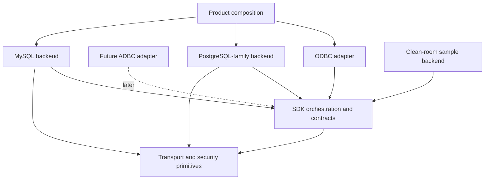

# Connectivity SDK architecture contract

Decision date: 2026-09-30.
Audit baseline: `089e085` on `codex/transport-foundation`.
Status: S1 architecture baseline accepted for S2 implementation. Internal names
may change during migration; responsibilities and dependency rules are frozen.

This document defines the engineering boundary required by G12. It was derived
from four independent read-only reviews: dependency/leakage, pooling/cache,
MySQL/external-author usability, and code/architecture security. It describes
the intended architecture, not the current implementation state. Existing
PostgreSQL behavior remains protected by its complete regression gates.

## Decisions

| ID | Accepted decision | Consequence |
|---|---|---|
| A1 | PostgreSQL and MySQL are sibling backends behind SDK contracts | Neither backend wraps or depends on the other |
| A2 | `GenericDatabaseConnection` and `IProtocolParser` are PostgreSQL-family session machinery | Reclassify them during S2; do not add MySQL conditionals or make the parser a public SDK interface |
| A3 | Backend sessions own framing, handshake, authentication, protocol state, execution and recovery | Share transport/security/deadline primitives only where semantics agree |
| A4 | A static backend provider is separate from a live session | Product identity/defaults/options/static capabilities do not require constructing a fake disconnected session |
| A5 | Results and errors cross the SDK boundary in normalized, owning forms | PostgreSQL OIDs/tags/format codes and MySQL type/flag/packet fields remain private |
| A6 | Product composition owns compile-time backend registration | G12 requires one documented registration point, not runtime plugins or a stable ABI |
| A7 | The current `ConnectionPool` is prototype code and will not define the SDK pool contract | Replace its shared-pointer/manual-release model before any reuse claim; keep it internal and unadvertised meanwhile |
| A8 | ODBC is the first client adapter; ADBC attaches later through a batch-result seam | No Arrow or ADBC dependency enters G12 |
| A9 | Secure transport/authentication, resource budgets and extension trust are architecture concerns | The mandatory rules are in [SECURITY_MODEL.md](SECURITY_MODEL.md) |
| A10 | Cryptography provider and linkage are explicit build-time product profiles behind private adapters | DSNs cannot select libraries; provider types do not enter SDK/backend contracts; see [CRYPTO_PROVIDER_PLAN.md](CRYPTO_PROVIDER_PLAN.md) |

## Dependency model

The apparent arrows from concrete backends to SDK mean that they implement SDK
contracts. SDK orchestration never includes or links concrete backend code.
Product composition selects one provider and injects it into the adapter.

Required build-layer direction:

1. `transport` depends only on utility/security primitives.
2. `sdk_contracts` depends on utility types and may refer to transport factories,
   never concrete transports or backends.
3. Concrete backends depend on `sdk_contracts` and `transport`.
4. SDK orchestration depends only on `sdk_contracts`.
5. ODBC depends on SDK orchestration and ODBC headers, never concrete backend or
   protocol headers.
6. Product composition depends on the selected adapter and concrete backend.

CI will reject backend-to-ODBC includes, transport-to-database includes, sibling
backend includes, protocol/native identifiers in shared ODBC workflows, backend
selection macros outside composition/family code, and layer cycles.

## Extension-facing contracts

Names below are conceptual internal names. S2 may adjust spelling without
changing their responsibilities.

### `BackendProvider`

One immutable provider exists per backend product. It owns:

- stable backend identifier and display/driver/setup identity;
- default port, optional database/catalog default and secure TLS policy;
- common and backend-specific connection-property schema and validation;
- static capability and normalized type profiles available before connection;
- pure SQL dialect and marker-processing service;
- creation of one live `BackendSession` from validated owning settings, an
  injected transport factory/security context and resource limits;
- optional facet declarations.

The provider does not hold credentials or mutable server state. Explicit product
selection is authoritative. Unknown URL schemes or ports must return an error,
not silently select PostgreSQL.

### `BackendSession`

A live session owns protocol and server state. It provides:

- open/close and explicit passive state;
- direct and parameterized execution;
- statement description when advertised;
- absolute deadlines for every blocking operation;
- owning normalized results or a structured `BackendError`;
- transaction control through an optional declared facet;
- catalog metadata through an optional declared facet;
- health/reset/reuse through an optional declared facet;
- server identity and cache epoch after open.

One physical session permits one operation at a time in G12. Shared code cannot
assume concurrent use. A future native-cancellation facet may be added; until
then timeout or cancellation with ambiguous protocol state retires the session.

### `SqlDialect`

This pure service owns parameter-marker lexing and ODBC escape translation. It
performs no I/O, retains no connection state and contains no ODBC handle logic.

### `TypeSystem`

This service owns native type interpretation and cell decoding. Native descriptors
remain opaque inside a backend. Before values cross the boundary, the backend
produces normalized schema and normalized cells. Server-defined/domain resolution
may use the live session when advertised. Advertised types use normalized SDK
types and contain no ODBC constants.

### Optional facets

Optional behavior uses explicit capability/facet presence, not downcasts, empty
stubs or catch-all interfaces:

- transaction control;
- statement description;
- catalog metadata;
- session reuse/reset;
- native cancellation later;
- persistent native prepared handles later;
- cache invalidation signals without cache policy.

An absent facet produces one predictable unsupported result and is never
advertised through ODBC capabilities.

## Connection configuration and transport ownership

The ODBC adapter owns ODBC precedence, string/buffer validation and conversion
from DSN/connection-string inputs into a neutral property set. The provider owns
defaults, backend-specific option validation and conversion to owning settings.

The provider creates a session with an injected transport factory plus immutable
security and resource policy. The backend session controls protocol-specific
connection order and TLS transition. This supports PostgreSQL client-first
SSLRequest and MySQL server-first capability negotiation without branching in
the adapter or a universal session state machine.

The adapter may request a stricter security policy, but cannot weaken a backend
minimum silently. Configured CA inputs must be applied or rejected. They cannot
be accepted and ignored.

## Normalized execution model

The backend boundary separates schema, delivery and completion:

- `NormalizedSchema`: column name, normalized scalar family, nullability,
  precision, scale, display/octet length and optional normalized provenance.
- `NormalizedCell`: explicit NULL or owning canonical value. Binary is raw bytes;
  text is valid UTF-8; numeric and temporal forms follow documented canonical
  encodings until richer internal types are justified.
- `RowBatch`: one schema plus zero or more rows for G12.
- `ExecutionItem`: ordered result set, update count, warning or deferred error.
- `ExecutionResult`: ordered owning items and final session disposition.
- `ParameterDescription`: normalized parameter metadata, separate from results.

The ODBC adapter maps these values to ODBC buffers and diagnostics. It never
decodes PostgreSQL bytea/boolean text, MySQL binary-protocol cells, command tags,
native type identifiers or protocol messages.

G12 may materialize bounded row batches. A later batch-reader contract can emit
row or columnar batches behind the same schema/execution ordering. ADBC/Arrow
types do not appear in SDK contracts until their own milestone.

## Structured errors and session disposition

Every failed SDK operation returns one owning `BackendError` containing:

- normalized error class;
- safe primary message;
- optional native state and numeric code;
- operation and lifecycle context;
- session disposition: `Reusable`, `ResetRequired` or `Retire`;
- retry information only when the backend can establish it safely.

Mutable `last_error`/`last_sqlstate` side channels are not part of the extension
contract. ODBC owns SQLSTATE/diagnostic mapping. SQLSTATE alone never decides
whether a session is reusable. Protocol errors, resource-limit violations,
ambiguous partial writes, reset failures and reset timeouts retire the session.

## Reuse, pooling and caches

Driver Manager pooling and any internal SDK pool use the same session-reuse
contract. The backend reports passive status and implements bounded health/reset;
shared policy decides whether and when to pool or probe.

The replacement internal pool uses a move-only RAII lease. One physical session
has at most one logical borrower. Stale, foreign and duplicate return are
impossible by type. Release performs the declared reset or retires the session.
The existing copyable `shared_ptr`/manual-release pool remains private prototype
code until replaced; patching its counters does not make it acceptable.

Reset covers the promised baseline: rollback open/failed transactions, restore
catalog/isolation/role and supported session variables, clear diagnostics and
native prepared state, validate credential generation and invalidate affected
caches. Unresettable state causes retirement or an explicit narrower profile.

Every cache declares owner/scope, key, hard bound, concurrency, sensitive-data
classification, epoch/invalidation inputs and observable events. Statement type
metadata remains statement-scoped initially. New prepared caches, cross-session
caches and pool tuning require G10 evidence. Query-result caching is outside the
SDK.

## Catalogs and capabilities

The core catalog facet returns normalized catalog results. A backend may use a
query-based helper internally, but executable SQL is not the universal extension
contract. This permits future HTTP/API backends without pretending they execute
catalog SQL.

Static provider capabilities are available before connect. Version-dependent
capabilities are fixed for a session after open and carry the server identity/
epoch that invalidates cached metadata on reconnect. Backend capabilities and
the ODBC `SQLGetInfo` profile remain related but separate concepts.

## Build and registration boundary

S2 introduces distinct internal targets for transport, SDK contracts,
orchestration, PostgreSQL-family backend, MySQL backend, ODBC adapter and product
composition. Concrete protocol headers are private. Backend macros and compiled
identity remain in composition or backend-family code.

Cryptography implementation and shared/static dependency linkage are independent
build-time product choices. The provider-neutral SDK accepts security policy and
verified-channel evidence; only private security/transport adapters see provider
types. The required profiles, artifact evidence and AWS-LC proof are defined in
[CRYPTO_PROVIDER_PLAN.md](CRYPTO_PROVIDER_PLAN.md).

Existing S2/S2C reviews also preserve future FIPS flexibility: separate provider
selection from operation policy, keep security initialization/lifetime explicit,
and allow richer module/approval evidence without backend or ODBC leakage.
Session reuse must respect immutable security policy. These are design review
criteria, not authorization to implement FIPS APIs or qualify a FIPS profile;
the deferred scope is defined in the crypto plan.

G12 needs one documented compile-time provider registration point. Adding the
clean-room backend may add its own sources and one product registration record;
it changes zero shared ODBC workflow files. Runtime discovery, dynamic plugins,
stable ABI and semantic compatibility remain G13 decisions.

S4 stages an explicit extension-header allowlist and exported targets. Installing
the entire `core/` tree does not satisfy the clean-room proof.

## S2 migration order

Each item is a separate reviewable implementation batch and keeps PostgreSQL,
iODBC UTF-16/UCS-4, Windows, sanitizer and package gates green.

1. **Security prerequisites:** verified-TLS default for credential authentication,
   reject cleartext-password auth without verified encryption, apply/reject CA
   settings, and remove production current/parent-directory DSN discovery.
2. **Provider/composition:** centralize identity, defaults, options, static
   capabilities and the single compile-time registration point.
3. **Crypto provider/linkage:** introduce the private provider boundary and
   strict build profiles, preserve OpenSSL, then qualify the bounded AWS-LC
   Linux proof and artifact inspection.
4. **Error/lifecycle:** introduce structured errors, disposition and resource
   budgets; migrate PostgreSQL without mutable error side channels.
5. **Normalized results:** make PostgreSQL normalize schema/cells and ordered
   execution items before the ODBC boundary.
6. **Session/facets:** split the live session from static dialect/type/catalog
   services; reclassify PostgreSQL-family parser/session code.
7. **Build/dependency gates:** split internal targets, make protocol headers
   private and automate forbidden-dependency checks.
8. **Reuse contract:** introduce exclusive lease/reset/health test fixtures and
   quarantine or replace the prototype pool before any pooling claim.

Do not combine these into a wholesale rewrite. Compatibility adapters may exist
inside one batch and must be removed when its callers migrate. MySQL protocol
implementation begins only after the accepted S2 contracts compile and the
PostgreSQL gates pass.

## S1 review disposition

The reviews rejected these approaches:

- extending one universal `IProtocolParser` for both protocols;
- adding MySQL branches to PostgreSQL session machinery;
- exposing ODBC or Arrow types in backend contracts;
- a universal authentication-plugin framework;
- runtime plugin loading or stable ABI promises in G12;
- advertising or tuning the current pool;
- general query-result caching;
- forcing every backend to implement all catalogs or capabilities.

S1 found implementation blockers but no reason to abandon the SDK direction.
The accepted structure is smaller than the current `IDatabaseConnection`, maps
to two real protocols, preserves PostgreSQL, and leaves clear extension points
for Redshift specialization and later ADBC delivery.

## S2 normalized column metadata checkpoint — 2026-10-01

The PostgreSQL-family session supplies owning normalized column types for direct,
prepared, additional-result and description schemas before returning them. Shared
ODBC column mapping requires that metadata and no longer calls describe_type on
native column IDs. Synthesized catalogs follow the same requirement. Missing
normalized column metadata is a backend-contract error, not an implicit native
fallback. This is the first normalized-schema migration stage: native fields are
still present in parser/result migration storage, parameter IDs still use the
existing resolver/cache, and cell normalization still occurs during ODBC fetch.
No complete A5 or normalized-result gate is claimed by this checkpoint.

## S2 normalized parameter descriptions checkpoint — 2026-10-01

Prepared execution and statement description now return ordered, owning normalized
parameter types. The PostgreSQL-family backend performs native/domain resolution
after draining the response, retaining the caller's absolute deadline. Incomplete
resolution returns an owning InvalidMetadata error with no partial result; domain
lookup failures retain ResolveTypes provenance and prior ODBC diagnostic fallback.
Shared ODBC maps only normalized descriptions and validates the described count.
Its native-ID cache and resolver orchestration are removed. Existing ODBC
normalized descriptor/revision caching remains. The backend resolves returned
parameter metadata afresh; a replacement native cache waits for the accepted
ownership/invalidation/epoch contracts and measurements. Repeated domain lookups
may cost an extra catalog round trip. Native IDs remain only in parser migration
storage; cell normalization and session facets remain separate S2 stages.

## S2 canonical binary/Boolean cells checkpoint — 2026-10-01

The PostgreSQL-family session converts known Binary columns to raw bytes and
Boolean columns to "0"/"1" before returning primary/additional results. Shared
ODBC no longer invokes backend cell decoders; that method is removed from the
IDatabaseConnection contract and remains PostgreSQL-family implementation code.
Malformed native values discard their native encoding and carry an owning,
sorted, unique zero-based cell-error coordinate snapshot plus a non-NULL empty
placeholder. This keeps bound-fetch/GetData 22018 timing and output preservation;
unrequested cells do not cause eager execution failure. NULL and ordinary empty
values remain distinct. ODBC validates error coordinates before applying state
and filters errors for rows removed by MaxRows. Errors are immutable snapshots:
later session changes cannot repair an already returned malformed cell.
This completes the known binary/Boolean decoding move, not all A5: UTF-8 text
validation, richer numeric/temporal canonical forms, native migration fields and
ordered execution/session facets remain open. Existing count/wire limits bound
this storage, but no exact aggregate heap quota is claimed.

## S2 text-cell UTF-8 checkpoint — 2026-10-01

The PostgreSQL-family session validates Char, VarChar and LongVarChar cells
before returning primary/additional results. Valid UTF-8 bytes are preserved
in place, including embedded NULs; empty and NULL remain distinct. Malformed
text is discarded and represented by the same owning deferred cell-error
coordinates used for binary/Boolean values. Fetch/GetData reports 22018 for
requested cells, preserving affected buffers and indicators for ANSI, wide and
binary targets; unrequested malformed cells do not fail execution or fetch.
Tests cover both session compositions, all three text families, Unicode limits,
overlong/surrogate/out-of-range/truncated encodings, immutable snapshots and
protocol/next-row recovery. Binary bytes bypass UTF-8 validation.

This is text-cell validation, not transcoding or metadata-name normalization.
Numeric/temporal canonical forms, native migration-field removal, ordered
execution and session/reuse facets remain S2 work. Existing wire/count ceilings
apply; no exact heap quota or additional provider qualification is claimed.

## S2 native metadata service boundary — 2026-10-01

Native type interpretation and domain resolution are removed from the required
IDatabaseConnection API. PostgreSQL retains its private parser/resolver hooks
and original deadline/error rules; the ID-keyed resolver map is moved out of
the normalized scalar header. Independent backend contract tests now implement
only normalized metadata services, with compile-time checks proving the SDK
has no native-ID lookup methods. PostgreSQL mapping, domain happy/error cases,
metadata output preservation and recovery remain regression gates.

QueryResult parser migration fields, ordered execution, richer numeric/temporal
canonical forms, metadata-name validation and session/reuse facets remain open.
This is an internal C++ contract change; it changes no external ODBC entry point
or supported PostgreSQL behavior and makes no crypto qualification claim.

## S2 result structure and column-name validation — 2026-10-01

Column names must be valid UTF-8 without embedded NULs; empty names are valid.
Every row must have exactly one cell per schema column. A shared validation
helper checks primary/additional results before publication at the PostgreSQL
backend and before ODBC applies synthetic-backend results. Fully drained invalid
metadata returns an owning InvalidMetadata error and preserves same-owner
protocol reuse. ODBC reports HY000 for structural/name contract failures and
owning metadata errors, including SQLMoreResults, without allowing native
SQLSTATE to override that classification. No partial result schema is exposed.

Tests cover Unicode/empty names through ANSI/wide metadata, malformed UTF-8/NUL
names, short/long/zero-schema rows, invalid additional results, untouched metadata
outputs and direct/prepared/deferred recovery. Native parser migration fields,
ordered execution, richer scalar forms and session/reuse facets remain open;
this batch adds no provider qualification or pooling claim.

## S2 typed server-version service — 2026-10-01

IDatabaseConnection exposes an owning, no-I/O server_version() value instead of
a named native server-parameter map. Empty means unknown/unavailable. PostgreSQL
ParameterStatus keys remain private implementation details, including its
version-dependent type catalog. ODBC and the existing internal synchronized
wrapper consume only the typed version service. Compile-time contract coverage
prevents reintroducing get_parameter on the SDK session interface.

Tests preserve ODBC ANSI/wide SQL_DBMS_VER formatting for normal, vendor-suffixed,
empty and malformed advertised versions without metadata I/O. Factory/session
tests cover pre-open emptiness, negotiated values, unrelated parameter updates,
disconnect clearing and owning snapshots; existing type-catalog and wrapper-read
tests remain green. Factory-based examples use the typed accessor, and the
main CI build now compiles examples to protect their SDK call sites. SDK
examples check owning backend results explicitly; PostgreSQL handshake/query/
prepared/error smoke tests and failed-connect exit behavior pass. This is
not a complete server-identity/cache-epoch facet,
and does not repair or qualify the prototype pool. Session/facet splitting,
ordered execution and native result migration fields remain S2 work.

## S2 native completion/provenance fields removed — 2026-10-01

QueryResult no longer exposes command_tag, and column metadata no longer carries
PostgreSQL table OIDs/attribute numbers. The private parser validates and consumes
those wire fields, classifies an ephemeral completion tag, and returns only
StatementKind and affected-row counts. No ODBC provenance feature used these
fields, so supported ODBC behavior is unchanged; future provenance must use
normalized semantics instead of native identifiers. Compile-time contract checks
prevent these fields from returning to the SDK result structures.

Parser tests retain type-field offset checks with nonzero provenance, completion
kind/count/order checks and owning snapshots; edge cases cover truncated
provenance and missing/trailing completion terminators followed by parser recovery.
Type IDs, widths/modifiers, format codes and parameter IDs still require a private
parser-result split. Ordered execution items, richer scalar forms and session/
reuse facets remain S2 work; no pooling/provider qualification is added.

## S2 private parser-result split — 2026-10-01

SDK `QueryResult` now exposes only normalized column and ordered parameter
metadata. Native type IDs, sizes/modifiers and wire format codes reside in private
`ParsedQueryResult`; PostgreSQL-family parsing and decoding stay below the session
boundary. Each drained response is validated and converted to an owning SDK
snapshot before publication. Additional parser results must be flat and ordered;
nested private results fail atomically as invalid metadata.

Prepared/description parameter resolution uses the original absolute deadline.
Resolver errors preserve their owning session/disposition snapshot, including local
input-limit rejection without I/O; incomplete resolution returns no partial result
and records the drained session state. Direct execution never triggers parameter
resolution, so catalog lookups cannot recurse through this conversion.

Compile-time SDK tests forbid native metadata fields. Parser tests retain native
wire-offset/format coverage; session/ODBC tests cover normalized ownership, primary
and additional results, malformed metadata/cells, binary-format rejection, lookup
failures and reusable-session recovery. Ordered execution items, richer scalar
forms, session/reuse facets and provider qualification remain open S2 work.

## S2 execution-sequence validation — 2026-10-01

The materialized SDK execution contract now explicitly requires a flat ordered
sequence. A primary operation failure uses BackendResult's error alternative;
additional deferred errors are error-only items and cannot also carry schema,
rows, cell errors, parameter descriptions or completion metadata. This prevents
silent item loss or publication of contradictory success/error results.

PostgreSQL validates the normalized sequence after response drain and before
return. Shared ODBC validates the entire sequence before queuing additional items
or publishing result state. Contract violations return fixed metadata diagnostics;
a protocol-ready session stays available to its current owner. This does not add
replay or pooling guarantees.

Tests cover direct and prepared rejection/recovery for nested sequences, root
errors and every contradictory deferred-item payload, plus native-parser
contradictions with post-drain recovery. Happy-path ordering distinguishes a
nonzero update count, an empty rowset with schema, a zero update count and a
deferred server error. Existing native multi-result tests protect PostgreSQL
ordering. A dedicated ExecutionItem/ExecutionResult representation, warning items,
final execution disposition and separate parameter-description delivery remain
open; this checkpoint enforces the current materialized contract rather than
closing the whole ordered-execution milestone.

Statement description has a separate metadata-only gate: primary errors, additional
items, rows and cell-error ledgers are rejected before parameter/column metadata
is published or cached. SQLDescribeParam/SQLNumResultCols rejection leaves caller
outputs unchanged and a later valid description can retry on the same session.

## S2 owning operation session snapshots — 2026-10-01

BackendResult now provides a passive, owning SessionSnapshot for both success and
failure. Successful PostgreSQL query, prepared execution and statement description
outcomes record their final state/disposition after response drain and parameter
resolution. The snapshot belongs to the operation envelope, not individual
rowsets; callers retaining only QueryResult deliberately retain data rather than
the operation status. Deferred errors retain the same final session context.

Failures derive the snapshot from the existing owning BackendError, so later
internal error annotation has one source of truth. Successes that do not report a
snapshot default to Unknown/Retire. Void results support explicit snapshots, but
connect/transaction/health/reset success annotation remains later session-facet
work; no blanket success-status or production pooling claim is made.

Reusable means protocol-ready for the current owner at operation completion. It
is not a health probe, reset completion, permission to pool or a promise that a
later call cannot fail. Transaction/failed-transaction outcomes require reset.
Copy/move, later ambiguous retirement, disconnect and backend destruction cannot
rewrite retained success snapshots. Tests cover all three PostgreSQL states,
prepared/description completion, deferred-error agreement, conservative defaults
and the error record's single source of truth. Dedicated ordered ExecutionItems,
warning delivery and separate parameter descriptions remain open S2 work.

## S2 connection and transaction success snapshots — 2026-10-01

Successful PostgreSQL connection outcomes now own the final passive startup
state/disposition. Successful transaction and isolation adapters preserve the
underlying command outcome's SessionSnapshot rather than discarding it or
recomputing it from a later mutable session reading. Existing failure records,
operation context and absolute deadlines remain unchanged.

Tests cover BEGIN/COMMIT/ROLLBACK/isolation wire completions, all adapter actions
and isolation levels, conservative Unknown/Retire propagation and reported states
differing from the probe's current state. Connection tests retain snapshots across
copy/move, invalid reconnect rejected before I/O, later ambiguous loss, disconnect
and backend destruction. Invalid reconnect preserves the current owner's state;
it neither changes the earlier connection outcome nor grants a pooling lease.

This supersedes the earlier deferral of connection/transaction success annotation.
Health/reset/lease facets, optional service separation, ordered execution items
and warning delivery remain open S2 work. A completed BEGIN requires reset even
though it succeeded; no automatic replay, health check or production pooling
support is added.

## S2 provider-owned SQL dialect service — 2026-10-01

ISqlDialect is a pure provider-owned service for parameter-marker counting and
SQL escape translation. IDatabaseConnection no longer requires either method.
PostgreSQL-family providers expose an immutable service using the existing lexer
and translator; native parser composition helpers remain private implementation
code. SQL dialect rules do not require credentials, a transport or a live session.

ODBC direct/prepared execution and SQLNativeSql A/W now use the selected provider
service. Existing connection, buffer/Unicode, SQL byte-budget, marker-budget,
NoScan and diagnostic guards retain their order and behavior. Translation strings
are owning snapshots; service references last for the provider lifetime.

The independent synthetic backend session compiles without dialect methods; its
provider owns the dialect. Tests cover use before session creation, borrowed
input overwritten after translation, retained results after provider destruction,
error/recovery, PostgreSQL quotes/comments/dollar quotes and stable service
identity across session creation/destruction. Compile-time checks prevent SQL
services returning to the SDK session interface.

This closes the pure SQL-dialect extraction within S2 session/service separation.
Type/catalog and optional transaction/description/reuse facets, internal target
separation, ordered execution representation and warning delivery remain open.
No MySQL protocol or speculative Redshift specialization is introduced.

## S2 optional transaction-session facet — 2026-10-01

Transaction control and isolation now live on the optional ITransactionSession
facet. IDatabaseConnection exposes stable borrowed facet discovery, defaulting to
absence, and no longer requires transaction/capability/isolation methods.
PostgreSQL implements the facet; the generic PostgreSQL-family machinery and
independent synthetic backend no longer need unsupported transaction stubs.

Shared ODBC obtains transaction capabilities from a live facet when connected.
Before connection, or after an unsuccessful open has disconnected its session,
the immutable provider declaration supports attribute planning. A provider
advertisement cannot grant missing live behavior: guarded adapter dispatch
returns an owning unsupported error without I/O. A failed deferred-isolation
open can correct its settings and retry. Existing PostgreSQL command/deadline,
error annotation and success snapshots are preserved.

Tests cover absent facet discovery, stable PostgreSQL facet lifetime across
open/disconnect, closed-session failures, live capability suppression despite
provider overadvertisement, no-I/O autocommit/isolation rejection, safe command
recovery and failed-open setting correction/retry. Compile-time checks keep
transaction operations off the required SDK session interface. Existing native
transaction and ODBC suites protect happy-path and failure behavior.

This extracts transaction behavior only. Statement-description/catalog/reuse
facets, static type services, internal build targets and the ordered execution
representation remain S2 work. No reset/health/pooling guarantee is added.
