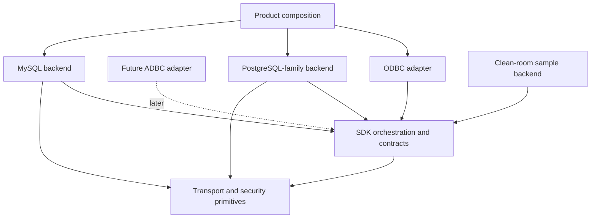

# Connectivity SDK architecture contract

Decision date: 2026-09-30.
Audit baseline: `089e085` on `codex/transport-foundation`.
Status: S1 architecture baseline accepted for S2 implementation. Internal names
may change during migration; responsibilities and dependency rules are frozen.

This document defines the engineering boundary required by G12. It was derived
from four independent read-only reviews: dependency/leakage, pooling/cache,
MySQL/external-author usability, and code/architecture security. It describes
the intended architecture, not the current implementation state. Existing
PostgreSQL behavior remains protected by its complete regression gates.

## Decisions

| ID | Accepted decision | Consequence |
|---|---|---|
| A1 | PostgreSQL and MySQL are sibling backends behind SDK contracts | Neither backend wraps or depends on the other |
| A2 | `GenericDatabaseConnection` and `IProtocolParser` are PostgreSQL-family session machinery | Reclassify them during S2; do not add MySQL conditionals or make the parser a public SDK interface |
| A3 | Backend sessions own framing, handshake, authentication, protocol state, execution and recovery | Share transport/security/deadline primitives only where semantics agree |
| A4 | A static backend provider is separate from a live session | Product identity/defaults/options/static capabilities do not require constructing a fake disconnected session |
| A5 | Results and errors cross the SDK boundary in normalized, owning forms | PostgreSQL OIDs/tags/format codes and MySQL type/flag/packet fields remain private |
| A6 | Product composition owns compile-time backend registration | G12 requires one documented registration point, not runtime plugins or a stable ABI |
| A7 | The current `ConnectionPool` is prototype code and will not define the SDK pool contract | Replace its shared-pointer/manual-release model before any reuse claim; keep it internal and unadvertised meanwhile |
| A8 | ODBC is the first client adapter; ADBC attaches later through a batch-result seam | No Arrow or ADBC dependency enters G12 |
| A9 | Secure transport/authentication, resource budgets and extension trust are architecture concerns | The mandatory rules are in [SECURITY_MODEL.md](SECURITY_MODEL.md) |
| A10 | Cryptography provider and linkage are explicit build-time product profiles behind private adapters | DSNs cannot select libraries; provider types do not enter SDK/backend contracts; see [CRYPTO_PROVIDER_PLAN.md](CRYPTO_PROVIDER_PLAN.md) |

## Dependency model

The apparent arrows from concrete backends to SDK mean that they implement SDK
contracts. SDK orchestration never includes or links concrete backend code.
Product composition selects one provider and injects it into the adapter.

Required build-layer direction:

1. `transport` depends only on utility/security primitives.
2. `sdk_contracts` depends on utility types and may refer to transport factories,
   never concrete transports or backends.
3. Concrete backends depend on `sdk_contracts` and `transport`.
4. SDK orchestration depends only on `sdk_contracts`.
5. ODBC depends on SDK orchestration and ODBC headers, never concrete backend or
   protocol headers.
6. Product composition depends on the selected adapter and concrete backend.

CI will reject backend-to-ODBC includes, transport-to-database includes, sibling
backend includes, protocol/native identifiers in shared ODBC workflows, backend
selection macros outside composition/family code, and layer cycles.

## Extension-facing contracts

Names below are conceptual internal names. S2 may adjust spelling without
changing their responsibilities.

### `BackendProvider`

One immutable provider exists per backend product. It owns:

- stable backend identifier and display/driver/setup identity;
- default port, optional database/catalog default and secure TLS policy;
- common and backend-specific connection-property schema and validation;
- static capability and normalized type profiles available before connection;
- pure SQL dialect and marker-processing service;
- creation of one live `BackendSession` from validated owning settings, an
  injected transport factory/security context and resource limits;
- optional facet declarations.

The provider does not hold credentials or mutable server state. Explicit product
selection is authoritative. Unknown URL schemes or ports must return an error,
not silently select PostgreSQL.

### `BackendSession`

A live session owns protocol and server state. It provides:

- open/close and explicit passive state;
- direct and parameterized execution;
- statement description when advertised;
- absolute deadlines for every blocking operation;
- owning normalized results or a structured `BackendError`;
- transaction control through an optional declared facet;
- catalog metadata through an optional declared facet;
- health/reset/reuse through an optional declared facet;
- server identity and cache epoch after open.

One physical session permits one operation at a time in G12. Shared code cannot
assume concurrent use. A future native-cancellation facet may be added; until
then timeout or cancellation with ambiguous protocol state retires the session.

### `SqlDialect`

This pure service owns parameter-marker lexing and ODBC escape translation. It
performs no I/O, retains no connection state and contains no ODBC handle logic.

### `TypeSystem`

This service owns native type interpretation and cell decoding. Native descriptors
remain opaque inside a backend. Before values cross the boundary, the backend
produces normalized schema and normalized cells. Server-defined/domain resolution
may use the live session when advertised. Advertised types use normalized SDK
types and contain no ODBC constants.

### Optional facets

Optional behavior uses explicit capability/facet presence, not downcasts, empty
stubs or catch-all interfaces:

- transaction control;
- statement description;
- catalog metadata;
- session reuse/reset;
- native cancellation later;
- persistent native prepared handles later;
- cache invalidation signals without cache policy.

An absent facet produces one predictable unsupported result and is never
advertised through ODBC capabilities.

## Connection configuration and transport ownership

The ODBC adapter owns ODBC precedence, string/buffer validation and conversion
from DSN/connection-string inputs into a neutral property set. The provider owns
defaults, backend-specific option validation and conversion to owning settings.

The provider creates a session with an injected transport factory plus immutable
security and resource policy. The backend session controls protocol-specific
connection order and TLS transition. This supports PostgreSQL client-first
SSLRequest and MySQL server-first capability negotiation without branching in
the adapter or a universal session state machine.

The adapter may request a stricter security policy, but cannot weaken a backend
minimum silently. Configured CA inputs must be applied or rejected. They cannot
be accepted and ignored.

## Normalized execution model

The backend boundary separates schema, delivery and completion:

- `NormalizedSchema`: column name, normalized scalar family, nullability,
  precision, scale, display/octet length and optional normalized provenance.
- `NormalizedCell`: explicit NULL or owning canonical value. Binary is raw bytes;
  text is valid UTF-8; numeric and temporal forms follow documented canonical
  encodings until richer internal types are justified.
- `RowBatch`: one schema plus zero or more rows for G12.
- `ExecutionItem`: ordered result set, update count, warning or deferred error.
- `ExecutionResult`: ordered owning items and final session disposition.
- `ParameterDescription`: normalized parameter metadata, separate from results.

The ODBC adapter maps these values to ODBC buffers and diagnostics. It never
decodes PostgreSQL bytea/boolean text, MySQL binary-protocol cells, command tags,
native type identifiers or protocol messages.

G12 may materialize bounded row batches. A later batch-reader contract can emit
row or columnar batches behind the same schema/execution ordering. ADBC/Arrow
types do not appear in SDK contracts until their own milestone.

## Structured errors and session disposition

Every failed SDK operation returns one owning `BackendError` containing:

- normalized error class;
- safe primary message;
- optional native state and numeric code;
- operation and lifecycle context;
- session disposition: `Reusable`, `ResetRequired` or `Retire`;
- retry information only when the backend can establish it safely.

Mutable `last_error`/`last_sqlstate` side channels are not part of the extension
contract. ODBC owns SQLSTATE/diagnostic mapping. SQLSTATE alone never decides
whether a session is reusable. Protocol errors, resource-limit violations,
ambiguous partial writes, reset failures and reset timeouts retire the session.

## Reuse, pooling and caches

Driver Manager pooling and any internal SDK pool use the same session-reuse
contract. The backend reports passive status and implements bounded health/reset;
shared policy decides whether and when to pool or probe.

The replacement internal pool uses a move-only RAII lease. One physical session
has at most one logical borrower. Stale, foreign and duplicate return are
impossible by type. Release performs the declared reset or retires the session.
The existing copyable `shared_ptr`/manual-release pool remains private prototype
code until replaced; patching its counters does not make it acceptable.

Reset covers the promised baseline: rollback open/failed transactions, restore
catalog/isolation/role and supported session variables, clear diagnostics and
native prepared state, validate credential generation and invalidate affected
caches. Unresettable state causes retirement or an explicit narrower profile.

Every cache declares owner/scope, key, hard bound, concurrency, sensitive-data
classification, epoch/invalidation inputs and observable events. Statement type
metadata remains statement-scoped initially. New prepared caches, cross-session
caches and pool tuning require G10 evidence. Query-result caching is outside the
SDK.

## Catalogs and capabilities

The core catalog facet returns normalized catalog results. A backend may use a
query-based helper internally, but executable SQL is not the universal extension
contract. This permits future HTTP/API backends without pretending they execute
catalog SQL.

Static provider capabilities are available before connect. Version-dependent
capabilities are fixed for a session after open and carry the server identity/
epoch that invalidates cached metadata on reconnect. Backend capabilities and
the ODBC `SQLGetInfo` profile remain related but separate concepts.

## Build and registration boundary

S2 introduces distinct internal targets for transport, SDK contracts,
orchestration, PostgreSQL-family backend, MySQL backend, ODBC adapter and product
composition. Concrete protocol headers are private. Backend macros and compiled
identity remain in composition or backend-family code.

Cryptography implementation and shared/static dependency linkage are independent
build-time product choices. The provider-neutral SDK accepts security policy and
verified-channel evidence; only private security/transport adapters see provider
types. The required profiles, artifact evidence and AWS-LC proof are defined in
[CRYPTO_PROVIDER_PLAN.md](CRYPTO_PROVIDER_PLAN.md).

Existing S2/S2C reviews also preserve future FIPS flexibility: separate provider
selection from operation policy, keep security initialization/lifetime explicit,
and allow richer module/approval evidence without backend or ODBC leakage.
Session reuse must respect immutable security policy. These are design review
criteria, not authorization to implement FIPS APIs or qualify a FIPS profile;
the deferred scope is defined in the crypto plan.

G12 needs one documented compile-time provider registration point. Adding the
clean-room backend may add its own sources and one product registration record;
it changes zero shared ODBC workflow files. Runtime discovery, dynamic plugins,
stable ABI and semantic compatibility remain G13 decisions.

S4 stages an explicit extension-header allowlist and exported targets. Installing
the entire `core/` tree does not satisfy the clean-room proof.

## S2 migration order

Each item is a separate reviewable implementation batch and keeps PostgreSQL,
iODBC UTF-16/UCS-4, Windows, sanitizer and package gates green.

1. **Security prerequisites:** verified-TLS default for credential authentication,
   reject cleartext-password auth without verified encryption, apply/reject CA
   settings, and remove production current/parent-directory DSN discovery.
2. **Provider/composition:** centralize identity, defaults, options, static
   capabilities and the single compile-time registration point.
3. **Crypto provider/linkage:** introduce the private provider boundary and
   strict build profiles, preserve OpenSSL, then qualify the bounded AWS-LC
   Linux proof and artifact inspection.
4. **Error/lifecycle:** introduce structured errors, disposition and resource
   budgets; migrate PostgreSQL without mutable error side channels.
5. **Normalized results:** make PostgreSQL normalize schema/cells and ordered
   execution items before the ODBC boundary.
6. **Session/facets:** split the live session from static dialect/type/catalog
   services; reclassify PostgreSQL-family parser/session code.
7. **Build/dependency gates:** split internal targets, make protocol headers
   private and automate forbidden-dependency checks.
8. **Reuse contract:** introduce exclusive lease/reset/health test fixtures and
   quarantine or replace the prototype pool before any pooling claim.

Do not combine these into a wholesale rewrite. Compatibility adapters may exist
inside one batch and must be removed when its callers migrate. MySQL protocol
implementation begins only after the accepted S2 contracts compile and the
PostgreSQL gates pass.

## S1 review disposition

The reviews rejected these approaches:

- extending one universal `IProtocolParser` for both protocols;
- adding MySQL branches to PostgreSQL session machinery;
- exposing ODBC or Arrow types in backend contracts;
- a universal authentication-plugin framework;
- runtime plugin loading or stable ABI promises in G12;
- advertising or tuning the current pool;
- general query-result caching;
- forcing every backend to implement all catalogs or capabilities.

S1 found implementation blockers but no reason to abandon the SDK direction.
The accepted structure is smaller than the current `IDatabaseConnection`, maps
to two real protocols, preserves PostgreSQL, and leaves clear extension points
for Redshift specialization and later ADBC delivery.

## S2 normalized column metadata checkpoint — 2026-10-01

The PostgreSQL-family session supplies owning normalized column types for direct,
prepared, additional-result and description schemas before returning them. Shared
ODBC column mapping requires that metadata and no longer calls describe_type on
native column IDs. Synthesized catalogs follow the same requirement. Missing
normalized column metadata is a backend-contract error, not an implicit native
fallback. This is the first normalized-schema migration stage: native fields are
still present in parser/result migration storage, parameter IDs still use the
existing resolver/cache, and cell normalization still occurs during ODBC fetch.
No complete A5 or normalized-result gate is claimed by this checkpoint.

## S2 normalized parameter descriptions checkpoint — 2026-10-01

Prepared execution and statement description now return ordered, owning normalized
parameter types. The PostgreSQL-family backend performs native/domain resolution
after draining the response, retaining the caller's absolute deadline. Incomplete
resolution returns an owning InvalidMetadata error with no partial result; domain
lookup failures retain ResolveTypes provenance and prior ODBC diagnostic fallback.
Shared ODBC maps only normalized descriptions and validates the described count.
Its native-ID cache and resolver orchestration are removed. Existing ODBC
normalized descriptor/revision caching remains. The backend resolves returned
parameter metadata afresh; a replacement native cache waits for the accepted
ownership/invalidation/epoch contracts and measurements. Repeated domain lookups
may cost an extra catalog round trip. Native IDs remain only in parser migration
storage; cell normalization and session facets remain separate S2 stages.

## S2 canonical binary/Boolean cells checkpoint — 2026-10-01

The PostgreSQL-family session converts known Binary columns to raw bytes and
Boolean columns to "0"/"1" before returning primary/additional results. Shared
ODBC no longer invokes backend cell decoders; that method is removed from the
IDatabaseConnection contract and remains PostgreSQL-family implementation code.
Malformed native values discard their native encoding and carry an owning,
sorted, unique zero-based cell-error coordinate snapshot plus a non-NULL empty
placeholder. This keeps bound-fetch/GetData 22018 timing and output preservation;
unrequested cells do not cause eager execution failure. NULL and ordinary empty
values remain distinct. ODBC validates error coordinates before applying state
and filters errors for rows removed by MaxRows. Errors are immutable snapshots:
later session changes cannot repair an already returned malformed cell.
This completes the known binary/Boolean decoding move, not all A5: UTF-8 text
validation, richer numeric/temporal canonical forms, native migration fields and
ordered execution/session facets remain open. Existing count/wire limits bound
this storage, but no exact aggregate heap quota is claimed.

## S2 text-cell UTF-8 checkpoint — 2026-10-01

The PostgreSQL-family session validates Char, VarChar and LongVarChar cells
before returning primary/additional results. Valid UTF-8 bytes are preserved
in place, including embedded NULs; empty and NULL remain distinct. Malformed
text is discarded and represented by the same owning deferred cell-error
coordinates used for binary/Boolean values. Fetch/GetData reports 22018 for
requested cells, preserving affected buffers and indicators for ANSI, wide and
binary targets; unrequested malformed cells do not fail execution or fetch.
Tests cover both session compositions, all three text families, Unicode limits,
overlong/surrogate/out-of-range/truncated encodings, immutable snapshots and
protocol/next-row recovery. Binary bytes bypass UTF-8 validation.

This is text-cell validation, not transcoding or metadata-name normalization.
Numeric/temporal canonical forms, native migration-field removal, ordered
execution and session/reuse facets remain S2 work. Existing wire/count ceilings
apply; no exact heap quota or additional provider qualification is claimed.

## S2 native metadata service boundary — 2026-10-01

Native type interpretation and domain resolution are removed from the required
IDatabaseConnection API. PostgreSQL retains its private parser/resolver hooks
and original deadline/error rules; the ID-keyed resolver map is moved out of
the normalized scalar header. Independent backend contract tests now implement
only normalized metadata services, with compile-time checks proving the SDK
has no native-ID lookup methods. PostgreSQL mapping, domain happy/error cases,
metadata output preservation and recovery remain regression gates.

QueryResult parser migration fields, ordered execution, richer numeric/temporal
canonical forms, metadata-name validation and session/reuse facets remain open.
This is an internal C++ contract change; it changes no external ODBC entry point
or supported PostgreSQL behavior and makes no crypto qualification claim.

## S2 result structure and column-name validation — 2026-10-01

Column names must be valid UTF-8 without embedded NULs; empty names are valid.
Every row must have exactly one cell per schema column. A shared validation
helper checks primary/additional results before publication at the PostgreSQL
backend and before ODBC applies synthetic-backend results. Fully drained invalid
metadata returns an owning InvalidMetadata error and preserves same-owner
protocol reuse. ODBC reports HY000 for structural/name contract failures and
owning metadata errors, including SQLMoreResults, without allowing native
SQLSTATE to override that classification. No partial result schema is exposed.

Tests cover Unicode/empty names through ANSI/wide metadata, malformed UTF-8/NUL
names, short/long/zero-schema rows, invalid additional results, untouched metadata
outputs and direct/prepared/deferred recovery. Native parser migration fields,
ordered execution, richer scalar forms and session/reuse facets remain open;
this batch adds no provider qualification or pooling claim.

## S2 typed server-version service — 2026-10-01

IDatabaseConnection exposes an owning, no-I/O server_version() value instead of
a named native server-parameter map. Empty means unknown/unavailable. PostgreSQL
ParameterStatus keys remain private implementation details, including its
version-dependent type catalog. ODBC and the existing internal synchronized
wrapper consume only the typed version service. Compile-time contract coverage
prevents reintroducing get_parameter on the SDK session interface.

Tests preserve ODBC ANSI/wide SQL_DBMS_VER formatting for normal, vendor-suffixed,
empty and malformed advertised versions without metadata I/O. Factory/session
tests cover pre-open emptiness, negotiated values, unrelated parameter updates,
disconnect clearing and owning snapshots; existing type-catalog and wrapper-read
tests remain green. Factory-based examples use the typed accessor, and the
main CI build now compiles examples to protect their SDK call sites. SDK
examples check owning backend results explicitly; PostgreSQL handshake/query/
prepared/error smoke tests and failed-connect exit behavior pass. This is
not a complete server-identity/cache-epoch facet,
and does not repair or qualify the prototype pool. Session/facet splitting,
ordered execution and native result migration fields remain S2 work.

## S2 native completion/provenance fields removed — 2026-10-01

QueryResult no longer exposes command_tag, and column metadata no longer carries
PostgreSQL table OIDs/attribute numbers. The private parser validates and consumes
those wire fields, classifies an ephemeral completion tag, and returns only
StatementKind and affected-row counts. No ODBC provenance feature used these
fields, so supported ODBC behavior is unchanged; future provenance must use
normalized semantics instead of native identifiers. Compile-time contract checks
prevent these fields from returning to the SDK result structures.

Parser tests retain type-field offset checks with nonzero provenance, completion
kind/count/order checks and owning snapshots; edge cases cover truncated
provenance and missing/trailing completion terminators followed by parser recovery.
Type IDs, widths/modifiers, format codes and parameter IDs still require a private
parser-result split. Ordered execution items, richer scalar forms and session/
reuse facets remain S2 work; no pooling/provider qualification is added.

## S2 private parser-result split — 2026-10-01

SDK `QueryResult` now exposes only normalized column and ordered parameter
metadata. Native type IDs, sizes/modifiers and wire format codes reside in private
`ParsedQueryResult`; PostgreSQL-family parsing and decoding stay below the session
boundary. Each drained response is validated and converted to an owning SDK
snapshot before publication. Additional parser results must be flat and ordered;
nested private results fail atomically as invalid metadata.

Prepared/description parameter resolution uses the original absolute deadline.
Resolver errors preserve their owning session/disposition snapshot, including local
input-limit rejection without I/O; incomplete resolution returns no partial result
and records the drained session state. Direct execution never triggers parameter
resolution, so catalog lookups cannot recurse through this conversion.

Compile-time SDK tests forbid native metadata fields. Parser tests retain native
wire-offset/format coverage; session/ODBC tests cover normalized ownership, primary
and additional results, malformed metadata/cells, binary-format rejection, lookup
failures and reusable-session recovery. Ordered execution items, richer scalar
forms, session/reuse facets and provider qualification remain open S2 work.

## S2 execution-sequence validation — 2026-10-01

The materialized SDK execution contract now explicitly requires a flat ordered
sequence. A primary operation failure uses BackendResult's error alternative;
additional deferred errors are error-only items and cannot also carry schema,
rows, cell errors, parameter descriptions or completion metadata. This prevents
silent item loss or publication of contradictory success/error results.

PostgreSQL validates the normalized sequence after response drain and before
return. Shared ODBC validates the entire sequence before queuing additional items
or publishing result state. Contract violations return fixed metadata diagnostics;
a protocol-ready session stays available to its current owner. This does not add
replay or pooling guarantees.

Tests cover direct and prepared rejection/recovery for nested sequences, root
errors and every contradictory deferred-item payload, plus native-parser
contradictions with post-drain recovery. Happy-path ordering distinguishes a
nonzero update count, an empty rowset with schema, a zero update count and a
deferred server error. Existing native multi-result tests protect PostgreSQL
ordering. A dedicated ExecutionItem/ExecutionResult representation, warning items,
final execution disposition and separate parameter-description delivery remain
open; this checkpoint enforces the current materialized contract rather than
closing the whole ordered-execution milestone.

Statement description has a separate metadata-only gate: primary errors, additional
items, rows and cell-error ledgers are rejected before parameter/column metadata
is published or cached. SQLDescribeParam/SQLNumResultCols rejection leaves caller
outputs unchanged and a later valid description can retry on the same session.

## S2 owning operation session snapshots — 2026-10-01

BackendResult now provides a passive, owning SessionSnapshot for both success and
failure. Successful PostgreSQL query, prepared execution and statement description
outcomes record their final state/disposition after response drain and parameter
resolution. The snapshot belongs to the operation envelope, not individual
rowsets; callers retaining only QueryResult deliberately retain data rather than
the operation status. Deferred errors retain the same final session context.

Failures derive the snapshot from the existing owning BackendError, so later
internal error annotation has one source of truth. Successes that do not report a
snapshot default to Unknown/Retire. Void results support explicit snapshots, but
connect/transaction/health/reset success annotation remains later session-facet
work; no blanket success-status or production pooling claim is made.

Reusable means protocol-ready for the current owner at operation completion. It
is not a health probe, reset completion, permission to pool or a promise that a
later call cannot fail. Transaction/failed-transaction outcomes require reset.
Copy/move, later ambiguous retirement, disconnect and backend destruction cannot
rewrite retained success snapshots. Tests cover all three PostgreSQL states,
prepared/description completion, deferred-error agreement, conservative defaults
and the error record's single source of truth. Dedicated ordered ExecutionItems,
warning delivery and separate parameter descriptions remain open S2 work.

## S2 connection and transaction success snapshots — 2026-10-01

Successful PostgreSQL connection outcomes now own the final passive startup
state/disposition. Successful transaction and isolation adapters preserve the
underlying command outcome's SessionSnapshot rather than discarding it or
recomputing it from a later mutable session reading. Existing failure records,
operation context and absolute deadlines remain unchanged.

Tests cover BEGIN/COMMIT/ROLLBACK/isolation wire completions, all adapter actions
and isolation levels, conservative Unknown/Retire propagation and reported states
differing from the probe's current state. Connection tests retain snapshots across
copy/move, invalid reconnect rejected before I/O, later ambiguous loss, disconnect
and backend destruction. Invalid reconnect preserves the current owner's state;
it neither changes the earlier connection outcome nor grants a pooling lease.

This supersedes the earlier deferral of connection/transaction success annotation.
Health/reset/lease facets, optional service separation, ordered execution items
and warning delivery remain open S2 work. A completed BEGIN requires reset even
though it succeeded; no automatic replay, health check or production pooling
support is added.

## S2 provider-owned SQL dialect service — 2026-10-01

ISqlDialect is a pure provider-owned service for parameter-marker counting and
SQL escape translation. IDatabaseConnection no longer requires either method.
PostgreSQL-family providers expose an immutable service using the existing lexer
and translator; native parser composition helpers remain private implementation
code. SQL dialect rules do not require credentials, a transport or a live session.

ODBC direct/prepared execution and SQLNativeSql A/W now use the selected provider
service. Existing connection, buffer/Unicode, SQL byte-budget, marker-budget,
NoScan and diagnostic guards retain their order and behavior. Translation strings
are owning snapshots; service references last for the provider lifetime.

The independent synthetic backend session compiles without dialect methods; its
provider owns the dialect. Tests cover use before session creation, borrowed
input overwritten after translation, retained results after provider destruction,
error/recovery, PostgreSQL quotes/comments/dollar quotes and stable service
identity across session creation/destruction. Compile-time checks prevent SQL
services returning to the SDK session interface.

This closes the pure SQL-dialect extraction within S2 session/service separation.
Type/catalog and optional transaction/description/reuse facets, internal target
separation, ordered execution representation and warning delivery remain open.
No MySQL protocol or speculative Redshift specialization is introduced.

## S2 optional transaction-session facet — 2026-10-01

Transaction control and isolation now live on the optional ITransactionSession
facet. IDatabaseConnection exposes stable borrowed facet discovery, defaulting to
absence, and no longer requires transaction/capability/isolation methods.
PostgreSQL implements the facet; the generic PostgreSQL-family machinery and
independent synthetic backend no longer need unsupported transaction stubs.

Shared ODBC obtains transaction capabilities from a live facet when connected.
Before connection, or after an unsuccessful open has disconnected its session,
the immutable provider declaration supports attribute planning. A provider
advertisement cannot grant missing live behavior: guarded adapter dispatch
returns an owning unsupported error without I/O. A failed deferred-isolation
open can correct its settings and retry. Existing PostgreSQL command/deadline,
error annotation and success snapshots are preserved.

Tests cover absent facet discovery, stable PostgreSQL facet lifetime across
open/disconnect, closed-session failures, live capability suppression despite
provider overadvertisement, no-I/O autocommit/isolation rejection, safe command
recovery and failed-open setting correction/retry. Compile-time checks keep
transaction operations off the required SDK session interface. Existing native
transaction and ODBC suites protect happy-path and failure behavior.

This extracts transaction behavior only. Statement-description/catalog/reuse
facets, static type services, internal build targets and the ordered execution
representation remain S2 work. No reset/health/pooling guarantee is added.

## S2 optional statement-description facet — 2026-10-01

Pre-execution statement description now lives on IStatementDescription, a
session-owned optional facet discovered through IDatabaseConnection. The required
session interface no longer needs a description stub. The borrowed facet remains
stable through open/disconnect for its session lifetime; calls retain the original
absolute deadline, borrow inputs only until return and return owning normalized
metadata and passive session snapshots. Existing metadata-only shape validation
remains mandatory.

The PostgreSQL-family session implements the facet using its existing description
exchange and type resolution. Shared ODBC checks facet presence before preparing
metadata inputs or dispatching I/O. Absence returns HYC00 without changing outputs,
marking metadata cached or disconnecting. Live SQL_DESCRIBE_PARAMETER cannot
advertise support without the facet; execution metadata remains available after
normal execution even when pre-execution description is absent.

Tests cover repeated absent-facet rejection with unchanged parameter/column
outputs and no I/O, capability suppression, prepared/direct execution recovery,
and stable facet lifetime before open and after disconnect. Successful description
retains the original deadline and an owning metadata/session snapshot that survives
session destruction; closed-session failures retain operation and retirement state.
Existing malformed metadata, allocation/input limits, native description and ODBC
suites continue to protect PostgreSQL behavior.

This closes optional statement-description extraction only. Catalog/reuse facets,
static type services, internal build targets, dedicated ordered execution items and
warning delivery remain open S2 work. No pooling, MySQL or provider qualification
claim is added.

## S2 optional catalog-query facet — 2026-10-01

Catalog SQL construction now lives on the optional ICatalogQueries facet.
IDatabaseConnection supplies passive const discovery defaulting to absence;
GenericDatabaseConnection and the independent synthetic backend no longer require
unsupported catalog stubs. PostgreSQL supplies a stable session-owned facet using
its existing query builders. Construction performs no I/O or mutation, borrows
requests only until return and returns owning SQL. The facet remains valid through
open/disconnect for its session lifetime; presence does not promise every request
is supported. Execution still uses the normal deadline, diagnostics and normalized
result-validation path.

Shared ODBC rejects missing catalog discovery with HYC00 before modifying the
statement cursor or dispatching execution. SQLGetFunctions suppresses all eight
catalog functions when the live backend lacks the facet, consistently in scalar,
ODBC 2 array and ODBC 3 bitmap formats. General namespace and SQL-language capability
flags retain their meanings; they do not independently grant catalog discovery.
SQLGetTypeInfo still uses the separate advertised type catalog.

Tests cover all eight ANSI and wide catalog entry points with absent support,
no extra I/O or disconnect, preservation of the existing cursor and subsequent
prepared execution. They check all function-support formats and continued direct
execution support. PostgreSQL facet tests verify stable discovery before open,
while connected and after disconnect; owned SQL survives filter mutation and
session destruction. Existing catalog-pattern/quoting and live catalog suites
protect the supported PostgreSQL behavior.

This closes optional catalog-query extraction only. Static type services,
health/reset/lease facets, internal build targets, dedicated ordered execution
items and warning delivery remain open S2 work. No pooling or provider qualification
claim is added.

## S2 provider-owned advertised type policy — 2026-10-01

Advertised normalized type definitions now belong exclusively to the immutable
provider. IDatabaseConnection no longer requires type_catalog; the PostgreSQL-family
session and independent synthetic backend no longer duplicate that service.
IBackendProvider::type_catalog accepts an explicit advertised server-version view,
retained only until return, and selects immutable definitions whose spans and strings
remain valid for the provider lifetime across later profile selections. An empty
version selects the conservative profile. Native live type resolution remains
private backend behavior and is not moved onto the provider.

Shared ODBC selects types through its provider using the session's owning
server_version snapshot when available. PostgreSQL's existing version policy is
unchanged: numeric/decimal negative scales are advertised from major version 15,
while missing, unparseable or overflowing versions select the conservative range.
Normal PostgreSQL disconnect clears its advertisement; ambiguous retirement can
retain the last known version. Policy selection follows the advertised value, never
infers session reuse or substitutes a health probe.

Tests verify default/modern/legacy/overflow profiles, immutable prior views across
version selections and overwritten borrowed version inputs. The synthetic provider
owns its type definitions without a session method; ODBC SQLGetTypeInfo uses its
version-selected column size without catalog/query I/O, preserves earlier views,
and falls back when the advertised version becomes empty. Existing PostgreSQL
metadata and descriptor/type-info suites protect public behavior.

This closes advertised-type service extraction. Static capability/error policy,
health/reset/lease facets, internal build targets, dedicated ordered execution
items and warning delivery remain open S2 work. This is an advertised-type policy,
not a new canonical scalar/Arrow representation or an ADBC readiness claim.

## S2 provider-owned capability and diagnostic policy — 2026-10-01

Static capability declarations and native-state diagnostic mapping now belong to
IBackendProvider. IDatabaseConnection no longer requires either policy method;
GenericDatabaseConnection and independent synthetic sessions need no unsupported
policy stubs. PostgreSQL's session no longer accepts or stores a product display
name. The provider owns product identity and the capability strings remain valid
for its lifetime. Sessions can outlive their creating provider without borrowing
its static policy. ODBC retains its provider and derives live capability reporting
by masking a copy for absent facets, never mutating the declaration.

Pure native-state mapping receives borrowed native text and semantic ErrorContext,
returns owning normalized SQLSTATE text or no mapping for the caller's fallback,
and performs no I/O. The default provider policy supplies no mapping. PostgreSQL's
existing context-sensitive duplicate object/index and conversion/integrity mappings
are unchanged. ODBC validates mapped states and preserves class-first invalid
metadata, ResolveTypes and operation-specific fallback precedence. Diagnostic policy
never overrides the owning operation's session state, retirement or retry rules.

Tests cover provider identity ownership despite caller input mutation, independent
session use after provider destruction, stable static capability snapshots across
open/disconnect and absent-facet masking, and provider error policy before session
creation with owning results after provider destruction. Existing contextual native
state mappings, malformed/unknown state fallback, direct/prepared/deferred errors,
metadata failures and passive session-snapshot tests protect both happy-path and
failure behavior. Compile-time checks keep both policy methods off the required
session interface.

This closes the remaining static capability/error service extraction in S2.
Health/reset/lease facets, internal build targets, dedicated ordered execution
items, warning delivery and richer normalized values remain open. No pooling,
public SDK qualification or ADBC readiness claim is added.

## S2 isolated internal SDK contract target — 2026-10-01

The internal `odbcpp::sdk_contracts` C++20 interface target exposes an explicit
20-header manifest through a freshly generated allowlisted include tree. It carries
no ODBC, PostgreSQL, crypto-provider or other external include/link dependencies.
`cmake -S sdk -B <build>` configures this surface independently of driver dependency
discovery. Every header compiles as the first and only include in a separate unit;
a minimal independent session consumer verifies closed-session failure, successful
execution and owning results/snapshots after input mutation and disconnect.

Configuration and unit gates enforce the manifest's transitive closure, reject
private/unlisted includes, external headers, unverifiable macro includes, path
escapes, duplicate/missing entries and known backend-selection/ODBC/crypto types.
Negative fixtures check actionable rejection diagnostics, while ordinary TLS/SSL
text in diagnostics remains permitted. These lexical guards complement compilation
and review; they are not a complete semantic security or dependency audit.

The root build includes the same checks on its supported platforms. This is an
internal build-only contract boundary: no installation/export, stable public ABI,
complete runtime target split or S4 clean-room author qualification is claimed.
Runtime implementation isolation, health/reset/exclusive leases, dedicated ordered
execution items, warning delivery and richer normalized values remain open S2 work.

## S2 internal runtime target ownership — 2026-10-01

Production compilation now uses separate internal OBJECT targets for runtime
primitives, backend implementation, product/legacy composition and the ODBC adapter.
GenericDatabaseConnection stays in the PostgreSQL-family backend partition; the
prototype pool stays with composition because it calls DatabaseFactory. No pool
qualification or backend-independent session claim follows from target names.

Core/test and production-driver objects compile separately. Test hooks are enabled
only on the core ODBC objects; backend-selection macros belong only to composition.
C++20, compiler warnings, PIC, SQLWCHAR ABI checks and private dependency includes
are applied where compilation actually occurs. Objects are flattened into the same
static archive and shared driver, preserving final exports, OpenSSL linkage,
Windows system libraries, static-crypto link maps and installed-target interfaces.
The isolated AWS-LC proof retains its existing source collector and build profile.

Source-partition fixtures verify PostgreSQL-family, prototype pool and Windows
ownership, normalize repeated inventory entries, and reject unknown sources,
resource entries, path escapes and empty partitions. Fixtures run under a build
path containing spaces. Existing behavior, test-hook, export, package and crypto
gates protect the resulting artifacts.

This establishes internal build ownership, not complete compile-time dependency
isolation: private include restrictions, installed protocol-header exposure and
legacy public wrapper includes remain step 7 work. Health/reset/exclusive leases,
ordered execution items, warning delivery and public SDK qualification remain open.

## S2 per-target private include closure — 2026-10-01

Each root-build runtime, backend, composition and ODBC object target now compiles
against its own explicit staged header manifest, without the full repository root
on its include path. Runtime cannot include database sessions; backend cannot
include ODBC; composition sees provider/factory/pool integration but not parser
machinery; ODBC sees contracts and its needed runtime helpers but no concrete
provider, protocol parser or prototype pool. An unused pool include was removed
from the ODBC handle header.

Configure-time checks enforce transitive quoted-include closure for every staged
header and component source. They reject unlisted headers, escapes, macro includes,
project angle-include bypasses including case/backslash/dot variants, duplicates,
missing entries and source-root escapes through header symlinks. Fresh generated
trees remove stale entries. Source edits trigger automatic reconfiguration, with
an incremental-build regression fixture covering source-local include bypasses. Compiler probes run inside the parent configuration,
using its generator/toolchain/platform, and verify allowed headers compile while
forbidden cross-component headers do not. Negative fixtures also run under paths
containing spaces; the symlink fixture runs where link creation is supported.

These are source dependency gates, not a compiler/filesystem security sandbox.
Legacy core/test include interfaces and installed header layout remain unchanged;
installed protocol-header exposure and public SDK packaging are still open work.
The separate AWS-LC qualification build retains its existing bounded profile.
Health/reset/exclusive leases, ordered execution items and warning delivery remain
open S2 contracts.

## S2 optional active health facet — 2026-10-01

`IDatabaseConnection::session_health()` now returns an optional session-owned
`ISessionHealth` facet. Absence is explicit; a minimal external backend need not
implement it. The facet pointer remains valid for the session lifetime, including
disconnected state. Callers serialize probes with all other session operations.
`check_health` accepts the original absolute deadline and returns an owning
success/failure session snapshot. No reconnect or operation replay is performed.

PostgreSQL implements one `SELECT 1` exchange through its existing bounded
execution path. It validates the fixed result shape/value and protocol-ready
state before returning success. An unexpected successful response retires the
session. Failures preserve their owning diagnostic details and final disposition,
with `CheckHealth` operation context. A transaction probe leaves the transaction
open; a failed transaction remains `ResetRequired` and is not silently rolled
back. Deadline, transport and malformed-protocol failures retain retirement.

This facet separates active health from the later reset/reuse contract. Success
establishes one exchange for the current owner, not credential freshness, cleanup,
a pool lease or future liveness. Passive `is_connected` remains unchanged; ODBC
`SQL_ATTR_CONNECTION_DEAD` behavior is unchanged. No pool or ODBC capability is
advertised by this addition. Reset, exclusive leases, credential generations,
cache invalidation, ordered execution items and warnings remain open S2 work.
The SDK header manifest and each private component closure include this neutral
contract; concrete probing SQL stays inside the PostgreSQL backend.

## S2 prototype pool quarantine — 2026-10-01

The legacy copyable/manual-release pool is removed from both production source
inventory and object-target partitioning, including the shared inventory used by
provider proofs. Only the private `odbcpp_prototype_pool` test/example target builds
it. Production composition no longer sees its header; a compiler probe rejects
that include. Source, partition and target guards reject accidental reinsertion.
Neither its target nor header nor example source is installed/exported. Existing
internal pool fixtures remain available, so quarantine does not remove tests.

Prototype `ThreadSafeConnection` now serializes direct and prepared exchanges with
exclusive locks. The coordinated concurrency regression holds a first operation
while a second attempts entry and checks all direct/prepared pairings. Its bounded
scheduling observation is not a mathematical proof of all thread schedules.
Copyable ownership, manual release and missing reset remain unsafe; the prototype
is not the SDK reuse implementation or public SDK API.

Acceptance includes full private-prefix installation checks and artifact inspection:
Unix checks static archive and full DLL/shared-library symbols; Windows checks the
static archive symbol table and DLL exports, combined with object/source guards
for hidden implementation. A positive-control prototype archive must expose both
known prototype classes to the inspector. Reset/credential generations/cache
invalidation and exclusive RAII leases remain the next S2 reuse work; no Driver
Manager or SDK pooling qualification is implied.

## S2 narrow PostgreSQL reset facet — 2026-10-01

`IDatabaseConnection::session_reset()` is an optional, session-owned `ISessionReset`
facet. Its pointer is stable for the session lifetime; callers serialize it with
all session operations. `SameAuthenticatedServerSession` cleans the original
authenticated physical session, without reconnect, replay or authorizing another
borrower. Results own their final snapshot and errors carry `ResetSession` context.

The PostgreSQL product explicitly opts into an immutable provider profile. The
PostgreSQL-family implementation and provider default to no reset profile; names
and identity strings do not enable it. Redshift does not opt in. Minimal external
backends remain valid without this facet.

PostgreSQL rolls back active/failed transactions, then executes `DISCARD ALL`,
using one caller-supplied absolute deadline. Exact native `ROLLBACK` and
`DISCARD ALL` completion tags are checked inside the private protocol path, before
normalization; they never enter SDK results. Wrong, duplicate, unterminated or
row-bearing completions fail. Success requires an idle, empty cleanup result. Any
cleanup failure, unknown state or malformed success closes the session, returns
`Disconnected/Retire`, and clears any replay-safety hint. A missing profile reports
unsupported without I/O.

The server baseline follows [PostgreSQL DISCARD ALL semantics](https://www.postgresql.org/docs/17/sql-discard.html),
which require execution outside a transaction. Live evidence covers changed
application name/isolation, temporary objects, prepared statements, advisory
locks, failed transactions and expired deadlines. The mandatory live executable
is PostgreSQL-only. Wire/unit fixtures also cover both cleanup steps, original
deadline forwarding, owning diagnostics/snapshots and failure retirement.

This is a backend cleanup primitive, not safe pooling acceptance. Shared
credential generations/expiry, cache epochs/invalidation and exclusive RAII
leases remain open. Shared policy must invalidate its cached statements and
metadata after reset before any new borrower; ODBC does not invoke the facet yet.
No ODBC pooling capability, Redshift reset or public SDK stability is claimed.

## S2 internal exclusive ownership primitive — 2026-10-01

`SessionOwner` and `SessionLease` establish single-session ownership in the shared
composition layer. They are internal implementation, excluded from installed
headers and the SDK contract manifest. Backend and shared ODBC component include
trees cannot see them. The quarantined prototype pool is unchanged.

A uniquely adopted, non-null session admits at most one move-only lease. Concurrent
`try_acquire()` calls coordinate under a short ownership mutex; checkout performs
no network operation and does not wait for a borrower to return. It does not infer
authentication, health, credential freshness or reuse permission. Moving or
destroying the same owner or lease requires external ordering. Operations on an
active lease and borrowed session/facet pointers must be serialized by the caller;
pointers cannot escape the lease lifetime. C++ cannot prevent deliberate sharing
of a raw borrowed pointer.

Owner destruction closes admission and retires an idle session. An active lease
pins its physical session even if its owner is destroyed or replaced. Lease
destruction, explicit retirement and replacement by move assignment remove the
session exactly once under the mutex, then disconnect and destroy it outside the
mutex. Disconnect exceptions are contained during noexcept teardown; external
backends remain responsible for releasing transport resources in their destructor.
Owner and lease moves leave their sources inert; self-moves preserve ownership.
There is no manual return token, foreign-owner return, raw ownership extraction,
new-session adoption or requeue API.

Retirement is terminal even after successful backend reset. Teardown never invokes
reset, health, reconnect or replay and carries no hidden network-cleanup deadline.
This deliberately narrower first step proves exclusivity/lifetime, not reusable
pooling. A later shared policy must establish credential generations/expiry, cache
epochs/invalidation and a bounded reset decision before adding reusable return.
No ODBC behavior or pooling capability changes.

Evidence includes move/type checks, concurrent checkout, repeated owner-destruction
versus lease-retirement races, reentrant disconnect, exception unwinding and
throwing-backend teardown. Focused ThreadSanitizer runs cover the ownership code.
Mandatory PostgreSQL live evidence verifies lease survival after owner destruction
and physical-session disappearance after retirement, including after a successful
reset. The live suite is PG-only; it grants no Redshift reset claim.

## S2 private credential authority and admission — 2026-10-01

`CredentialContext` starts revoked. A trusted composition coordinator publishes a
fresh opaque generation only after authentication/refresh validation for the same
complete immutable server, principal, authentication and TLS/security policy
context. The authority is an in-process capability, not proof that those semantic
inputs match and not a hostile-plugin sandbox. Issuer/context selection and real
credential-provider integration remain coordinator responsibilities. Tokens have
no secret/principal strings, printable identifiers, serialization or numeric epoch.

Each generation has a distinct allocation identity and optional monotonic expiry.
Tokens weakly reference their authority and retain only the immutable non-secret
generation. Publish clears the previous generation before allocation; allocation
failure or a null private test-factory result leaves the authority revoked.
Rotation/revoke/destruction invalidate old copies permanently; no integer wrap or
address-based public identity is used. Move assignment revokes the replaced
authority. Publish/revoke/current-token operations serialize on the authority
mutex; same-object moves/destruction require external ordering. Production expiry
validation reads time after locking, and `now == expiry` is invalid. A caller must
translate any external credential expiry conservatively into this monotonic bound.

`SessionOwner` can optionally bind the authenticated physical session to an exact
authority/generation token. The coordinator must establish that binding; it is
not inferred from username, endpoint, passive connectivity or token possession.
Bound owners require token-bearing checkout. Missing, foreign and same-authority
wrong-generation tokens are denied without disconnecting a valid owner. An exact
bound token that is rotated, revoked, expired or orphaned closes admission and
retires an idle session. An active lease remains usable and retires normally;
there is no forced interruption of in-flight work. Matching stale detection is
on admission, not a background expiry/eviction service. Admission can linearize
just before rotation/expiry; later changes do not revoke an already-issued lease.

Lock order is owner then authority, with no authority-to-owner callbacks or
backend calls under either lock. The private generation factory is local allocation
only; its fault-injection fixture cannot reenter. Existing unbound owners keep
the original one-shot semantics and cannot use token-bearing checkout. Every
return still retires: a newer credential token cannot reauthenticate or requeue
an old physical session. No public/installed SDK contract or ODBC behavior changes.

Focused evidence covers copy invalidation, no resurrection, exact expiry, moves,
allocation failure, concurrent publish/revoke/validation, wrong-token nondisruption,
idle retirement and active-lease survival. Focused TSan covers authority/admission
races. Mandatory PG live evidence publishes only after successful connection,
then verifies an active borrower survives authority revocation and eventually
retires the physical session.

Cache tokens are deliberately deferred. Reset remains directly callable through
a borrowed backend facet, so the owner cannot yet guarantee automatic invalidation
on every reset. The next prerequisite is a coordinator-observable reset/cache
invalidation path; reusable return must then combine reset outcome, current
credential binding and cache scope before it can be enabled. No cache, pool,
Driver Manager reuse or complete authentication-provider qualification is claimed.

## S2 coordinator cleanup path — 2026-10-01

Private `SessionLease::reset_session(deadline)` now coordinates explicit cleanup
of the active borrow. It forwards one original absolute deadline without health
probing, reconnect/replay or a replacement timeout. Expired deadlines, absent or
wrong reset profiles, returned failures, thrown exceptions, inconsistent success
snapshots/passive state and late completion all retire and destroy the physical
session. An armed scope guard also retires on exceptional diagnostic construction.
Returned failures own their diagnostics, normalize operation to ResetSession and
state/disposition to Disconnected/Retire, and contain no retry authorization.
Arbitrary exception text is not copied into diagnostics.

Only exact SameAuthenticatedServerSession profile and Idle/Reusable success plus
connected/Idle passive state can preserve the active lease. Backend I/O and
passive checks execute outside owner/authority locks. Caller serialization still
applies to all operations on one lease. Owner destruction or credential revocation
can close admission during cleanup without interrupting this active borrower.
Success is cleanup evidence for the same borrower; return/destruction remains
terminal, never a requeue or new-borrower grant.

The raw session reset facet remains reachable and can bypass this coordinator
path. Therefore cache tickets, automatic cache invalidation and reusable return
are still disabled. Next must guard/route every borrower reset and define cache
invalidation before caches or reusable admission can be qualified. This private
method changes neither ODBC behavior nor backend reset/crypto qualification.

## S2 closed borrower access boundary — 2026-10-02

Private SessionLease no longer exposes a raw session or mutable/const backend
facet. Its public operation surface is direct execution, typed prepared
execution, coordinated reset, terminal retirement and an ownership boolean.
There are no current product/ODBC consumers of this internal primitive. Future
health/transaction/description/catalog access needs an explicit policy-aware
lease contract; do not restore a generic raw accessor as a shortcut.

Execution forwards the SQL view, typed parameter span and original deadline
unchanged. Results/errors remain owning and unchanged, including operation-time
snapshots, native details and retry hints; a hint never causes automatic replay.
Either success or failure with Retire disposition destroys the physical session
before returning the owning outcome. Any execution exception retires before
rethrowing the original exception. Reusable/ResetRequired remain usable only
by the same exclusive borrower; they grant no return/requeue. Moved/retired lease
operations fail locally with operation-specific NotConnected/Disconnected/Retire.
No external backend callbacks run under ownership or credential mutexes.

Ordinary borrower reset now has only the coordinator path, which closes the
previous raw-facet bypass. This is a trusted native C++ contract, not a sandbox
against malicious code or pre-adoption escaped pointers. Trusted composition
must not retain physical pointers after unique adoption. Cache tokens/reuse are
still disabled: arbitrary SQL can change session/schema state, so classification
and invalidation must cover execution as well as reset and credential rotation.
Define conservative cache scopes and invalidation next, before reusable return.
ODBC behavior and provider/linkage qualification do not change.

## S2 conservative local cache scopes — 2026-10-02

Private SessionCacheToken is an opaque, copyable/movable local validity capability
with weak owner-state and weak generation references. It contains no payload,
secret, SQL, principal string, serialized identifier or numeric epoch and cannot
keep a physical session or generation object alive. Old weak control blocks
prevent identity reuse from resurrecting a token. No public SDK surface is added.

Only an active credential-bound lease can mint a scope after connected/Idle
passive checks. Those backend calls run outside ownership locks; a second check
under the owner lock revalidates admission, ownership, physical identity and
credential freshness before issuing/reusing a generation. Unbound, non-Idle,
closed and stale contexts cannot mint. Passive inspection failure clears scope
without interrupting the borrower. Generation allocation/null-factory failure
leaves scope absent and can fall back to uncached work; it grants no validity.
The private test factory is non-reentrant and production only allocates identity.

Every direct/prepared/reset attempt clears scope before validation or backend
access, including recoverable errors, exceptions and expired/unsupported resets.
Owner closure, terminal retirement and observed credential staleness also clear
scope. Authority expiry/revoke/rotation is consulted under the fixed owner-to-
authority lock order, without backend calls or interruption of an active borrow.
Moves preserve the same scope; replacement destroys the old destination scope.

`token.is_current()` validates its origin at one point in time. Consumers must
also call the requesting `lease.accepts_cache(token)` to enforce exact origin
and current generation. Foreign scopes deny without disrupting either borrower.
Validation is not a reservation; issuance alone is not permission to consume a
later stale token. Observing stale credentials closes future admission but never
moves the active physical session. Same-lease operations remain caller-serialized.

This intentionally invalidates on all SQL, without classifying mutations. It is
not query-result caching, cache storage, external-schema freshness, health/reuse
qualification or Driver Manager pooling. Payload ownership, hard bounds, keys,
secret handling, TTL/revalidation for external changes and observable cache policy
remain separate requirements; selective preservation/performance needs G10 proof.
Bounded reusable return and real credential-provider integration remain open.

## S2 explicit same-owner reusable return — 2026-10-02

Private `SessionLease::return_reusable(deadline)` is the only opt-in handoff.
Ordinary destruction/retire and every failed return remain terminal. Unbound
one-shot owners cannot reissue sessions. Return requires open admission and the
original authenticated credential generation to be current, invalidates all local
cache scopes, and always calls coordinated backend reset exactly once with the
original absolute deadline. Passive Idle alone never authorizes handoff.

After exact SameAuthenticatedServerSession reset, Idle/Reusable outcome and
passive consistency checks, the coordinator rechecks physical identity, open
admission, current bound credentials and the deadline under the ownership lock.
Success clears even scopes minted by a backend callback during reset, marks the
session unleased and detaches the old lease atomically before any checkout can
win. The old lease then cannot retire its successor. Failure retires outside locks;
owned reset diagnostics remain intact and synthetic failures expose no credentials.
No backend callback runs under ownership/credential locks.

Rotation/expiry during cleanup prevents reissue. Rotation after publication is
checked again at checkout and cannot bind a new generation to an old physical
session. Owner closure during cleanup does not interrupt I/O; return then retires.
Admission is a point-in-time decision, not a guarantee against later network loss.
No reconnect, replay, reauthentication, cross-owner queue, health shortcut or cache
payload is added. This is private single-owner reuse evidence, not an ODBC Driver
Manager pool or public SDK qualification. Production credential-provider binding,
pool health/age/capacity policy and real cache refresh/isolation remain open.

## S2 opt-in lifetime and idle retirement — 2026-10-02

Private credential-bound owners may adopt immutable `SessionReusePolicy` with a
finite absolute monotonic `retire_at` and positive `max_idle` duration. Existing
constructors retain their prior semantics; no production caller chooses defaults
here. Equality expires. Idle timing starts at adoption and restarts solely when
successful explicit return publishes the unleased session. Active leases are not
idle-timed; queries, cache operations, denied checkouts and standalone reset cannot
extend either limit. Elapsed-time comparison avoids adding arbitrary durations to
clock samples, including very large idle limits.

Missing/foreign/wrong-generation tokens remain nondisruptive and are rejected
before policy observation. Exact-token checkout closes expired admission, clears
scopes and destroys an idle session outside locks. An active lifetime-expired
borrow remains usable; cache validation/minting and lease operations close future
admission and invalidate scopes without interrupting it. Reusable return requires
lifetime validity before and after mandatory reset and reports terminal timeout
when that lifetime has expired. Successful return never renews absolute lifetime.

The private noexcept test clock permits deterministic equality/race evidence and
must be a local monotonic source without allocation, callbacks or reentry under
ownership locks. Production uses steady_clock. Original I/O deadlines still use
the real monotonic clock. No background eviction is supplied: an unobserved expired
idle session may remain allocated until matching checkout or owner destruction.
No active health, pool capacity, queue, ODBC reuse or provider qualification follows.

## S2 coordinated active-health admission — 2026-10-02

Private `SessionOwner::acquire_healthy(token, deadline)` returns an owning move-only
`BackendResult<SessionLease>`. Exact-token no-I/O admission first reserves an
exclusive local lease. A denied reservation does not probe or disrupt an existing
borrower/foreign context; existing exact stale credential/policy retirement rules
still apply. The existing `try_acquire` methods remain explicit internal primitives,
not proof of health and not product pool entry points.

After reservation the coordinator clears scopes, validates current credentials,
open admission, physical identity, lifetime and the unchanged real I/O deadline,
then invokes the optional session health facet once outside ownership/authority
locks. It requires exact Idle/Reusable and immediate passive connected/Idle state.
After probing it rechecks credentials, physical/admission/lifetime and deadline
under the ownership lock before transferring the lease into the result. Time is
sampled after credential validation; no replacement timeout is introduced.

Missing facet, failed exchange, malformed success, passive mismatch, exception,
late completion or closed/expired eligibility retires the reserved session.
Backend errors retain owning class/message/native details but become CheckHealth,
Disconnected/Retire with retry authorization cleared. Arbitrary exception text
is not exposed. The local RAII lease also covers exceptional diagnostic creation.
Success transfers ownership exactly once; result destruction otherwise retires.
A later credential/lifetime/owner change does not interrupt an admitted borrower.

No reset, reconnect, reauthentication, retry, replay, fallback probe SQL or pool
queue is added. Concrete probing remains backend-owned. Successful exchange proves
health only at that instant; the next operation can still fail. PostgreSQL live
evidence covers checked same-session reissue and rejection after server termination.
ODBC connection-dead semantics, Driver Manager pooling and public SDK qualification
remain unchanged. Product credential binding/defaults/capacity and cache payload
policies remain open before S2/G12 can close.

## S2 managed authenticated binding coordinator — 2026-10-02

Private `SessionOwner::connect_authenticated` uniquely takes one fresh disconnected
provider-created session, borrows resolved settings for one `connect` call and
requires exact Idle/Reusable with passive connected/Idle state. Finite lifetime,
positive idle limit, optional credential expiry and connection timeout are checked
before I/O and after connection/publication/owner construction. No owner is exposed
on failure, malformed success, exception or crossed bound. Cleanup retires the
physical session and normalized owned errors report Connect, Disconnected/Retire,
without retry authority or arbitrary exception text.

Only after successful physical authentication does the coordinator create and
publish its own credential authority for that one immutable physical/security
context. It retains the exact bound token privately, including after revocation or
expiry, so managed `acquire_healthy(deadline)` can still detect stale binding and
retire idle state. No token is exported; no refresh, reauthentication, reconnect or
new-generation rebinding is available. Owner moves carry authority and session
together. Closing/revoking managed credentials closes admission and invalidates
scopes; idle state retires immediately, active borrowers continue until retirement
and cannot return for reuse. External-authority constructors remain unchanged.

The coordinator retains no additional connection settings or secrets. This is not
an end-to-end secret-erasure claim: the PostgreSQL-family backend currently copies
settings including password during authentication; the bounded authentication
cleanup checkpoint now clears that retained copy, returned response buffers and
persistent SCRAM state. Parser-local intermediates and allocator copies remain
outside that checkpoint. A private authority-construction seam
covers allocation/null failure without exposing a configurable production factory.

This is production-capable internal composition, validated through the real backend,
not ODBC adoption or public SDK qualification. The ODBC adapter still owns raw
transaction/description/catalog facets; its migration requires bounded lease
facades and lifetime rules before replacing its session owner. Product defaults,
pool capacity, cache payload/refresh policy and S2/G12 remain open.

## S2 transaction and description lease facades — 2026-10-02

Private SessionLease now mediates transaction actions, isolation changes and
statement description through its exclusive physical borrow. Inputs are borrowed
for the call and the original deadline is forwarded unchanged. Facet pointers
never escape. Each attempt invalidates cache scopes before backend access, even
when the optional facet is absent. Missing facets return owning Unsupported errors
with the passive state; disconnected leases return NotConnected/Retire. Backend
results and native errors remain owned and unchanged. Retire snapshots and all
exception kinds retire exactly once; Reusable/ResetRequired only retain the same
borrower, never implicitly return it. Callbacks run outside ownership locks.

This is migration groundwork. Catalog construction, value-returning capability
and passive-status access, and ODBC lifecycle migration remain open. There is no
ODBC adoption, public SDK/pooling claim, retry/replay or Redshift live change.

Validation: focused unit/live PostgreSQL tests and all 76 credential/ownership
ThreadSanitizer tests passed. Read-only review found no implementation blocker;
its passive-state and owning-description test suggestions are covered. Complete
local PostgreSQL, iODBC UTF-16/UCS-4, ASan/UBSan and Redshift build/absent-endpoint
gates passed. Exact-head Windows/packaging and crypto CI evidence awaits the run.

## S2 owned passive observation and catalog construction — 2026-10-02

SessionLease::inspect returns owning connection/state/version information,
transaction capabilities and optional description/catalog presence. It performs
no network I/O or health probe. SessionLease::catalog_query borrows the request
only until return and returns owning SQL or diagnostics, without executing it.
Neither operation exposes the physical session or a facet pointer.

Successful passive reads and local catalog errors preserve cache scopes because
these facet contracts perform no session mutation. Contradictory connection/state
observations and exceptions retire; passive Disconnected outcomes retire. Idle
snapshots retain only the same borrower, while Transaction/FailedTransaction/Unknown
remain ResetRequired. No passive snapshot proves health or grants return/requeue.
All callbacks run outside ownership locks and no retries/replay are introduced.

Focused unit/live tests cover owned values after retirement, request forwarding,
exclusive callback access, absent facets, local diagnostic ownership, cache
preservation, passive-state matrices, inconsistent observations and exception kinds.
The live PostgreSQL fixture executes generated catalog SQL through ordinary query
execution and verifies advertised version and capability values.

ODBC lifecycle adoption is next; production pooling/defaults, cache payload policy
and S2/G12 remain open. MySQL scope, Redshift live access and crypto qualification
are unchanged. Read-only review found no blocker; facet flags explicitly denote
presence, not universal request support. All 81 credential/ownership ThreadSanitizer
tests passed. Complete local PostgreSQL, iODBC UTF-16/UCS-4, ASan/UBSan and
Redshift build/absent-endpoint gates passed. Windows/packaging and crypto evidence
await exact-head CI.

## S2 ODBC operation containment before ownership adoption — 2026-10-02

ODBCConnection no longer exposes get_db_connection or a replacement physical/facet
pointer. Statement direct/prepared execution, description and catalog construction
use private typed connection methods returning owning values/errors. SQLGetFunctions
uses a boolean catalog-facet presence query. Missing description remains rejected
before parameter-vector construction; existing diagnostic and execution timing are
preserved. Live health/reset tests retain their original ODBC configuration/transport
fixtures through a test-only view that owns the handle and returns values/errors,
never a physical session/facet pointer. An exact-name compile
regression guard rejects restoration of get_db_connection; it is not a general
scan for every possible renamed pointer escape. The test view is move-only,
requires serialized use before handle unregistration and has friendship only
with ODBCConnection.

This checkpoint deliberately retains the existing private unique physical owner.
The next ownership swap will adopt once into an unbound SessionOwner and retain
one terminal lease for the ODBC connection lifetime, without cache scopes,
return/reissue, probes at connect, or invented lifetime/idle product defaults.
Exact credential binding is mandatory before future reuse/pooling. ODBC-facing
mock successes must first gain truthful explicit snapshots; default Unknown/Retire
must remain terminal at the lease boundary. Active-health test routing also needs
a bounded lease operation or independent backend fixtures, never a raw ODBC escape.

No pooling, SDK/public qualification, MySQL expansion or Redshift live change is
claimed. S2/G12 and lifecycle adoption remain open. Focused backend-contract,
live handle-lifecycle and reset checks passed; read-only review found no blocker
after preserving the original configured-transport fixtures. Complete local
PostgreSQL, iODBC UTF-16/UCS-4, ASan/UBSan and Redshift build/absent-endpoint
gates passed. Final focused PostgreSQL checks passed after narrowing test authority.
Windows/packaging and crypto evidence await exact-head CI.

## S2 ODBC exclusive ownership adoption — 2026-10-02

ODBC now adopts an authenticated physical session into a private, unbound
SessionOwner and retains one exclusive terminal lease for the connection lifetime.
Execution, descriptions, catalogs, transactions and isolation use bounded lease
operations. No return/reissue, pooling, automatic reconnect, replay, cache payloads
or lifetime defaults are introduced. Exact credential binding remains mandatory
before future reuse. Backend default Unknown/Retire snapshots remain terminal;
ODBC-facing mocks now report explicit truthful Idle/Reusable snapshots.

Negotiated server version and capability/facet observations are owned at adoption;
SQL_ATTR_CONNECTION_DEAD uses passive lease observation without network I/O.
Logical ODBC-open state remains separate from physical liveness, so terminal rows
and diagnostics remain readable and explicit disconnect/reconnect remains required.
Disconnect clears observations back to provider defaults. Authentication and passive admission require exact Idle/Reusable evidence;
dirty or terminal successful setup results are rejected. Negotiated feature answers
remain stable while logically open after retirement. Setup exceptions clean
up the attempt, allocation failures report HY001, and a retired setup lease cannot
be published as an open connection. Lease retirement destroys the physical session
once; freeing a logically open connection remains a sequence error.

The private test view routes active health through a bounded borrower operation:
it invalidates local cache authority, preserves transaction-state results and
retires on terminal results or exceptions. It does not grant checked admission or
reuse authority. Timed-out reset retires its facet along with the physical session.
ODBC's internal include manifest/probes now permit ownership contracts while
continuing to deny protocol and prototype-pool headers. Credential header visibility
is a transitive owner-header requirement, not qualification for ODBC credential
authority use; separating those header surfaces remains follow-up work.

Validation: focused backend/ownership unit and live lifecycle/reset tests pass,
and all 83 credential/ownership tests pass under ThreadSanitizer. Complete local
PostgreSQL, iODBC UTF-16/UCS-4, ASan/UBSan and Redshift build/absent-endpoint
gates passed. Final focused diagnostic assertions also passed. Windows/packaging
and crypto evidence await exact-head CI. S2/G12 remain open;
credential-bound product reuse, cache policy and SDK qualification are subsequent
work. MySQL, Redshift live access and crypto qualification are unchanged.

## S2 credential-authority header isolation — 2026-10-02

The follow-up from ODBC ownership adoption is closed: `session_owner.h` now
forward-declares credential types instead of importing authority definitions.
Only trusted composition/implementation and explicitly bound test fixtures
include `credential_context.h`; the ODBC staged include tree excludes it.
Positive C++20 probes require the ownership header to compile independently,
keep both credential types incomplete, and preserve move/unbound-construction
contracts. Negative probes reject direct ODBC/backend authority includes while
composition still compiles its authority header. Runtime ownership, authentication,
reuse and ODBC behavior are unchanged; this is private header isolation, not a
hostile-plugin security boundary or public SDK/ABI qualification.

Focused ownership/backend and architecture tests pass; read-only review found no
blocker. All 83 ownership/credential ThreadSanitizer tests and complete local
PostgreSQL, iODBC UTF-16/UCS-4, ASan/UBSan and Redshift build/absent-endpoint
gates passed. Windows/packaging and crypto evidence await exact-head hosted CI.
S2/G12, product reuse/cache policy, MySQL proof and crypto qualification remain open.

## S2 prepared metadata session affinity — 2026-10-02

The existing statement-local description cache now keys successful metadata to
an opaque weak logical-session identity, in addition to preparation and IPD
revision. Cache hits require the same identity and an active exclusive lease.
Fresh successful connection setup creates the identity; failed setup and close
clear it. No credential, principal, SQL text or numeric generation is added to
this identity. It grants no backend reuse or cross-session cache authority.

Tests cover same-session hits without extra descriptions, timeout-close retaining
statement handles, failed opens preserving output arguments, reconnect with changed
parameter metadata, and terminal retirement rejecting stale prepared metadata.
A live PostgreSQL test changes temporary-table shape across timeout/reconnect and
requires fresh column metadata on the retained statement. Already-executed owning
rows/metadata remain readable after retirement. Public SQLDisconnect continues to
unregister its child handles. Read-only review found no blocker.

This closes connection-lifecycle affinity only. External schema freshness,
same-session mutation/reset invalidation, cache observability and full G12 cache
qualification remain open; no new prepared-statement payload cache, pooling,
performance or public SDK claim is made. Focused backend-contract and live metadata
tests passed. Complete local PostgreSQL, iODBC UTF-16/UCS-4, ASan/UBSan and
Redshift build/absent-endpoint gates passed. Windows/packaging and crypto evidence
await exact-head hosted CI.

## S2 conservative metadata epochs and control routing — 2026-10-02

Prepared description validity now uses a private connection-owned metadata epoch.
Direct/prepared execution, transaction/isolation, description, health and reset
attempts invalidate it before dispatch, including recoverable errors and absent
facets. Test-only health/reset views use private ODBC wrappers, closing an
invalidation bypass. Passive observation and local catalog construction preserve
it; executing catalog SQL still passes through execution invalidation.

Successful validated descriptions publish a fresh weak statement epoch only after
metadata application and only with an active lease. Terminal successful descriptions
return their owned metadata without publication; failed operations never restore
the previous epoch. Same-statement hits remain possible within an unchanged epoch.
Describing statement B deliberately invalidates statement A, so alternating
statements refetch; this conservative policy makes no performance claim. Already
executed results retain their owned metadata. The scope remains one logical
connection, one current epoch, existing statement payload/resource bounds and
serialized handle operations; no credentials or serialized identity are added.

Fixed Debug events expose hit, miss, stale rejection, invalidation and publication
without SQL, identifiers, principal, credential, pointer or epoch values. A SQL
canary regression verifies cache events do not disclose query contents. Unit tests
cover passive reads, control attempts, success/recoverable failure, alternating
statements and terminal descriptions. Live PostgreSQL tests prove same-session DDL
refresh, health/reset routing, DISCARD-related missing-table diagnostics and recovery.
Focused unit/live checks and complete local PostgreSQL, iODBC UTF-16/UCS-4,
ASan/UBSan and Redshift build/absent-endpoint gates passed. Final-source PostgreSQL
and UTF-16 rechecks passed after removing the unnecessary connect-time marker
allocation. Windows/packaging and crypto evidence await exact-head hosted CI. External
schema-change freshness remains unqualified; pooling, cross-session/prepared
payload caches, G10 tuning and public SDK claims are not enabled. S2/G12 remain open.

## S2 internal session baseline — 2026-10-02

A framework-independent test runner in `sdk/tests/session_baseline` now compiles
solely against the staged SDK contract headers. A standalone synthetic session
and a separate mandatory PostgreSQL adapter run the same checks. The adapter
provides settings, session construction and SQL; the runner contains no backend
SQL, native protocol, ODBC or crypto dependency. Checks cover exact Idle/Reusable
outcomes and passive agreement, known normalized types, scalar/NULL/empty cells,
typed prepared results, recoverable server-error classification/operation,
subsequent recovery, disconnect and retained owning results/diagnostics after
session destruction. Every execution uses a fresh finite deadline; early failures
disconnect through RAII. Reports contain fixed check IDs only.

This narrow baseline does not qualify provider/composition, optional facets,
transactions, pooling, ODBC, complete malformed-result handling, or the S4
backend-author kit. S2/G12 remain open.
